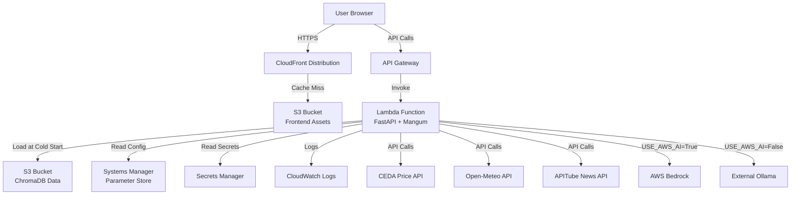

# Design Document: AWS Deployment

## Overview

This design document specifies the technical architecture for deploying the Krishi agricultural decision support application to AWS. The deployment creates a production-ready, publicly accessible prototype while preserving the local development environment.

The solution uses a serverless architecture with AWS Lambda for the FastAPI backend, S3 and CloudFront for the React frontend, and AWS managed services for configuration, persistence, and monitoring. The design prioritizes cost optimization, scalability, and maintainability through Infrastructure as Code.

### Key Design Decisions

1. **Serverless Architecture**: Lambda and API Gateway eliminate server management and enable automatic scaling to zero when idle, minimizing costs for a prototype deployment.

2. **Repository Cloning Strategy**: Creating a separate deployment repository preserves the working local codebase while allowing AWS-specific modifications without polluting the development environment.

3. **Mangum Adapter**: Using Mangum to wrap the FastAPI application enables seamless Lambda integration without modifying the core application code.

4. **S3 for ChromaDB**: Storing ChromaDB data in S3 provides cost-effective persistence for the vector database. The database is loaded into Lambda memory at cold start.

5. **AWS SAM**: Selected over CDK and CloudFormation for its balance of simplicity and power, with excellent Lambda integration and local testing capabilities.

6. **Hybrid AI Strategy**: Supporting both Ollama (external endpoint) and AWS Bedrock provides flexibility for different deployment scenarios and cost profiles.

## Architecture

### High-Level Architecture



### Component Architecture

#### Frontend Layer
- **CloudFront Distribution**: Global CDN providing HTTPS access, caching, and low-latency delivery
- **S3 Static Website**: Hosts built React application (HTML, CSS, JS, assets)
- **Build Process**: Vite production build with optimization and minification

#### Backend Layer
- **API Gateway**: REST API endpoint with request validation and throttling
- **Lambda Function**: Runs FastAPI application via Mangum ASGI adapter
- **Lambda Configuration**:
  - Runtime: Python 3.11
  - Memory: 1024 MB (adjustable based on ChromaDB size)
  - Timeout: 60 seconds (for AI inference calls)
  - Environment: Variables from Parameter Store/Secrets Manager

#### Data Layer
- **ChromaDB on S3**: Vector database stored as files in S3, loaded into Lambda memory at cold start
- **Persistence Strategy**: Read-only deployment (no runtime updates to ChromaDB)
- **Alternative**: EFS mount for larger databases or write requirements (future enhancement)

#### Configuration Layer
- **Parameter Store**: Non-sensitive configuration (URLs, feature flags, model names)
- **Secrets Manager**: Sensitive credentials (API keys, tokens)
- **Environment Variables**: Lambda environment variables populated from Parameter Store/Secrets Manager

#### External Integrations
- **CEDA Price API**: Agricultural commodity prices
- **Open-Meteo API**: Weather forecasts
- **APITube News API**: Agricultural news
- **AWS Bedrock**: Managed AI inference (optional)
- **External Ollama**: Self-hosted AI endpoint (optional)

## Components and Interfaces

### 1. Repository Cloning Module

**Purpose**: Create an isolated deployment repository from the local codebase

**Interface**:
```python
def clone_repository(
    source_path: str,
    target_path: str,
    preserve_git: bool = True
) -> CloneResult:
    """
    Clone the local repository to a deployment directory.
    
    Args:
        source_path: Path to local repository
        target_path: Path for deployment repository
        preserve_git: Whether to preserve git history
        
    Returns:
        CloneResult with status and target path
    """
```

**Implementation**:
- Use `shutil.copytree()` to copy entire directory structure
- Preserve `.git` directory to maintain version history
- Exclude `node_modules`, `venv`, `.venv`, `__pycache__`, `.pytest_cache`
- Create deployment-specific `.gitignore` additions

### 2. Backend Packaging Module

**Purpose**: Package FastAPI application for Lambda deployment

**Interface**:
```python
def package_backend(
    backend_path: str,
    output_path: str,
    include_chromadb: bool = True
) -> PackageResult:
    """
    Create Lambda deployment package for backend.
    
    Args:
        backend_path: Path to backend directory
        output_path: Path for deployment package
        include_chromadb: Whether to include ChromaDB in package
        
    Returns:
        PackageResult with package path and size
    """
```

**Implementation**:
- Install dependencies to package directory: `pip install -r requirements.txt -t package/`
- Add Mangum adapter: `pip install mangum -t package/`
- Copy application code to package directory
- Optionally include ChromaDB data (if small enough for Lambda layer)
- Create Lambda handler wrapper:

```python
# lambda_handler.py
from mangum import Mangum
from app.main import app

handler = Mangum(app, lifespan="off")
```

**Dependencies**:
- All packages from `requirements.txt`
- Additional: `mangum>=0.17.0`

### 3. Frontend Build Module

**Purpose**: Build and prepare frontend for S3 deployment

**Interface**:
```python
def build_frontend(
    frontend_path: str,
    api_endpoint: str,
    output_path: str
) -> BuildResult:
    """
    Build frontend application for production.
    
    Args:
        frontend_path: Path to frontend directory
        api_endpoint: API Gateway endpoint URL
        output_path: Path for build output
        
    Returns:
        BuildResult with build path and asset list
    """
```

**Implementation**:
- Set API endpoint in environment: `VITE_API_BASE_URL=<api_gateway_url>`
- Run Vite build: `npm run build`
- Output to `dist/` directory
- Generate asset manifest for cache invalidation

**Configuration**:
```javascript
// vite.config.js additions
export default defineConfig({
  build: {
    outDir: 'dist',
    sourcemap: false,
    minify: 'terser',
    rollupOptions: {
      output: {
        manualChunks: {
          vendor: ['react', 'react-dom'],
          charts: ['recharts'],
        }
      }
    }
  }
})
```

### 4. Infrastructure Provisioning Module

**Purpose**: Deploy AWS infrastructure using SAM templates

**Interface**:
```python
def deploy_infrastructure(
    template_path: str,
    stack_name: str,
    parameters: Dict[str, str],
    region: str = "ap-south-1"
) -> DeploymentResult:
    """
    Deploy AWS infrastructure using SAM.
    
    Args:
        template_path: Path to SAM template
        stack_name: CloudFormation stack name
        parameters: Stack parameters
        region: AWS region
        
    Returns:
        DeploymentResult with stack outputs
    """
```

**SAM Template Structure** (`template.yaml`):

```yaml
AWSTemplateFormatVersion: '2010-09-09'
Transform: AWS::Serverless-2016-10-31

Parameters:
  Environment:
    Type: String
    Default: prototype
  UseAWSAI:
    Type: String
    Default: "false"
    AllowedValues: ["true", "false"]

Globals:
  Function:
    Timeout: 60
    MemorySize: 1024
    Runtime: python3.11
    Environment:
      Variables:
        ENVIRONMENT: !Ref Environment

Resources:
  # Backend Lambda Function
  BackendFunction:
    Type: AWS::Serverless::Function
    Properties:
      CodeUri: backend/
      Handler: lambda_handler.handler
      Policies:
        - S3ReadPolicy:
            BucketName: !Ref ChromaDBBucket
        - SSMParameterReadPolicy:
            ParameterName: !Sub "/krishi/${Environment}/*"
        - Statement:
            - Effect: Allow
              Action:
                - secretsmanager:GetSecretValue
              Resource: !Sub "arn:aws:secretsmanager:${AWS::Region}:${AWS::AccountId}:secret:/krishi/${Environment}/*"
        - Statement:
            - Effect: Allow
              Action:
                - bedrock:InvokeModel
              Resource: "*"
              Condition:
                StringEquals:
                  "aws:RequestedRegion": !Ref AWS::Region
      Events:
        ApiEvent:
          Type: Api
          Properties:
            Path: /{proxy+}
            Method: ANY
            RestApiId: !Ref ApiGateway

  # API Gateway
  ApiGateway:
    Type: AWS::Serverless::Api
    Properties:
      StageName: !Ref Environment
      Cors:
        AllowOrigin: "'*'"
        AllowHeaders: "'*'"
        AllowMethods: "'*'"
      TracingEnabled: true
      MethodSettings:
        - ResourcePath: "/*"
          HttpMethod: "*"
          LoggingLevel: INFO
          DataTraceEnabled: true

  # Frontend S3 Bucket
  FrontendBucket:
    Type: AWS::S3::Bucket
    Properties:
      BucketName: !Sub "krishi-frontend-${Environment}-${AWS::AccountId}"
      WebsiteConfiguration:
        IndexDocument: index.html
        ErrorDocument: index.html
      PublicAccessBlockConfiguration:
        BlockPublicAcls: false
        BlockPublicPolicy: false
        IgnorePublicAcls: false
        RestrictPublicBuckets: false

  FrontendBucketPolicy:
    Type: AWS::S3::BucketPolicy
    Properties:
      Bucket: !Ref FrontendBucket
      PolicyDocument:
        Statement:
          - Effect: Allow
            Principal:
              Service: cloudfront.amazonaws.com
            Action: s3:GetObject
            Resource: !Sub "${FrontendBucket.Arn}/*"
            Condition:
              StringEquals:
                "AWS:SourceArn": !Sub "arn:aws:cloudfront::${AWS::AccountId}:distribution/${CloudFrontDistribution}"

  # ChromaDB S3 Bucket
  ChromaDBBucket:
    Type: AWS::S3::Bucket
    Properties:
      BucketName: !Sub "krishi-chromadb-${Environment}-${AWS::AccountId}"
      VersioningConfiguration:
        Status: Enabled
      LifecycleConfiguration:
        Rules:
          - Id: TransitionToIA
            Status: Enabled
            Transitions:
              - TransitionInDays: 30
                StorageClass: STANDARD_IA

  # CloudFront Distribution
  CloudFrontDistribution:
    Type: AWS::CloudFront::Distribution
    Properties:
      DistributionConfig:
        Enabled: true
        DefaultRootObject: index.html
        Origins:
          - Id: S3Origin
            DomainName: !GetAtt FrontendBucket.RegionalDomainName
            S3OriginConfig:
              OriginAccessIdentity: ""
            OriginAccessControlId: !Ref CloudFrontOAC
        DefaultCacheBehavior:
          TargetOriginId: S3Origin
          ViewerProtocolPolicy: redirect-to-https
          AllowedMethods: [GET, HEAD, OPTIONS]
          CachedMethods: [GET, HEAD]
          ForwardedValues:
            QueryString: false
            Cookies:
              Forward: none
          Compress: true
          DefaultTTL: 86400
          MaxTTL: 31536000
          MinTTL: 0
        CustomErrorResponses:
          - ErrorCode: 404
            ResponseCode: 200
            ResponsePagePath: /index.html
          - ErrorCode: 403
            ResponseCode: 200
            ResponsePagePath: /index.html
        PriceClass: PriceClass_100

  CloudFrontOAC:
    Type: AWS::CloudFront::OriginAccessControl
    Properties:
      OriginAccessControlConfig:
        Name: !Sub "krishi-oac-${Environment}"
        OriginAccessControlOriginType: s3
        SigningBehavior: always
        SigningProtocol: sigv4

Outputs:
  ApiEndpoint:
    Description: API Gateway endpoint URL
    Value: !Sub "https://${ApiGateway}.execute-api.${AWS::Region}.amazonaws.com/${Environment}"
  
  CloudFrontURL:
    Description: CloudFront distribution URL
    Value: !GetAtt CloudFrontDistribution.DomainName
  
  FrontendBucket:
    Description: Frontend S3 bucket name
    Value: !Ref FrontendBucket
  
  ChromaDBBucket:
    Description: ChromaDB S3 bucket name
    Value: !Ref ChromaDBBucket
```

### 5. Configuration Management Module

**Purpose**: Manage environment variables and secrets in AWS

**Interface**:
```python
def setup_configuration(
    environment: str,
    config_values: Dict[str, str],
    secret_values: Dict[str, str],
    region: str = "ap-south-1"
) -> ConfigResult:
    """
    Store configuration in Parameter Store and Secrets Manager.
    
    Args:
        environment: Environment name (prototype, staging, prod)
        config_values: Non-sensitive configuration
        secret_values: Sensitive credentials
        region: AWS region
        
    Returns:
        ConfigResult with parameter ARNs
    """
```

**Parameter Store Structure**:
```
/krishi/prototype/app_name = "Krishi Backend"
/krishi/prototype/debug = "false"
/krishi/prototype/open_meteo_url = "https://api.open-meteo.com/v1/forecast"
/krishi/prototype/news_api_url = "https://api.apitube.io/v1/news/everything"
/krishi/prototype/news_api_enabled = "true"
/krishi/prototype/use_aws_ai = "false"
/krishi/prototype/ollama_base_url = "http://external-ollama:11434/api/generate"
/krishi/prototype/ollama_model = "qwen2.5:1.5b"
```

**Secrets Manager Structure**:
```
/krishi/prototype/ceda_api_key = "<secret>"
/krishi/prototype/news_api_key = "<secret>"
```

**Lambda Environment Variable Injection**:
```python
# In Lambda handler initialization
import boto3
import os

def load_config():
    ssm = boto3.client('ssm')
    secrets = boto3.client('secretsmanager')
    env = os.environ.get('ENVIRONMENT', 'prototype')
    
    # Load from Parameter Store
    params = ssm.get_parameters_by_path(
        Path=f'/krishi/{env}/',
        Recursive=True,
        WithDecryption=False
    )
    
    # Load from Secrets Manager
    secret_names = [
        f'/krishi/{env}/ceda_api_key',
        f'/krishi/{env}/news_api_key'
    ]
    
    for name in secret_names:
        secret = secrets.get_secret_value(SecretId=name)
        # Set as environment variable
        key = name.split('/')[-1].upper()
        os.environ[key] = secret['SecretString']
```

### 6. ChromaDB Persistence Module

**Purpose**: Package and deploy ChromaDB data to S3

**Interface**:
```python
def deploy_chromadb(
    chromadb_path: str,
    s3_bucket: str,
    s3_prefix: str = "chromadb/"
) -> DeploymentResult:
    """
    Upload ChromaDB data to S3.
    
    Args:
        chromadb_path: Path to local ChromaDB directory
        s3_bucket: Target S3 bucket
        s3_prefix: S3 key prefix
        
    Returns:
        DeploymentResult with S3 URIs
    """
```

**Lambda ChromaDB Loading**:
```python
# In Lambda handler initialization
import boto3
import chromadb
from pathlib import Path
import tempfile

def load_chromadb_from_s3():
    s3 = boto3.client('s3')
    bucket = os.environ['CHROMADB_BUCKET']
    prefix = 'chromadb/'
    
    # Create temp directory
    temp_dir = Path(tempfile.mkdtemp())
    
    # Download ChromaDB files
    paginator = s3.get_paginator('list_objects_v2')
    for page in paginator.paginate(Bucket=bucket, Prefix=prefix):
        for obj in page.get('Contents', []):
            key = obj['Key']
            local_path = temp_dir / key.replace(prefix, '')
            local_path.parent.mkdir(parents=True, exist_ok=True)
            s3.download_file(bucket, key, str(local_path))
    
    # Initialize ChromaDB client
    client = chromadb.PersistentClient(path=str(temp_dir))
    return client

# Global variable for Lambda container reuse
chroma_client = None

def handler(event, context):
    global chroma_client
    if chroma_client is None:
        chroma_client = load_chromadb_from_s3()
    
    # Use chroma_client in application
    ...
```

**Size Considerations**:
- Lambda deployment package limit: 250 MB (unzipped)
- Lambda /tmp storage: 512 MB (ephemeral)
- If ChromaDB > 200 MB, use EFS mount instead of S3 download

### 7. Deployment Automation Module

**Purpose**: Orchestrate the complete deployment process

**Interface**:
```python
def deploy_application(
    config: DeploymentConfig
) -> DeploymentResult:
    """
    Execute complete deployment workflow.
    
    Args:
        config: Deployment configuration
        
    Returns:
        DeploymentResult with all endpoints and resources
    """
```

**Deployment Script** (`deploy.py`):

```python
#!/usr/bin/env python3
import subprocess
import sys
from pathlib import Path
import json

class Deployer:
    def __init__(self, environment="prototype", region="ap-south-1"):
        self.environment = environment
        self.region = region
        self.deployment_dir = Path("deployment")
        
    def clone_repository(self):
        """Step 1: Clone repository"""
        print("📦 Cloning repository...")
        # Implementation
        
    def setup_backend(self):
        """Step 2: Setup backend package"""
        print("🔧 Setting up backend...")
        # Install dependencies
        # Add Mangum
        # Create handler
        
    def build_frontend(self, api_endpoint):
        """Step 3: Build frontend"""
        print("🎨 Building frontend...")
        # Set API endpoint
        # Run npm build
        
    def deploy_infrastructure(self):
        """Step 4: Deploy SAM template"""
        print("☁️  Deploying infrastructure...")
        result = subprocess.run([
            "sam", "deploy",
            "--template-file", "template.yaml",
            "--stack-name", f"krishi-{self.environment}",
            "--capabilities", "CAPABILITY_IAM",
            "--region", self.region,
            "--parameter-overrides",
            f"Environment={self.environment}"
        ], capture_output=True, text=True)
        
        # Parse outputs
        return self._parse_stack_outputs()
        
    def upload_chromadb(self, bucket):
        """Step 5: Upload ChromaDB to S3"""
        print("💾 Uploading ChromaDB...")
        # Implementation
        
    def upload_frontend(self, bucket):
        """Step 6: Upload frontend to S3"""
        print("🚀 Uploading frontend...")
        subprocess.run([
            "aws", "s3", "sync",
            "frontend/dist/",
            f"s3://{bucket}/",
            "--delete"
        ])
        
    def invalidate_cloudfront(self, distribution_id):
        """Step 7: Invalidate CloudFront cache"""
        print("🔄 Invalidating CloudFront cache...")
        subprocess.run([
            "aws", "cloudfront", "create-invalidation",
            "--distribution-id", distribution_id,
            "--paths", "/*"
        ])
        
    def deploy(self):
        """Execute full deployment"""
        try:
            self.clone_repository()
            self.setup_backend()
            
            # Deploy infrastructure first to get API endpoint
            outputs = self.deploy_infrastructure()
            api_endpoint = outputs['ApiEndpoint']
            frontend_bucket = outputs['FrontendBucket']
            chromadb_bucket = outputs['ChromaDBBucket']
            cloudfront_url = outputs['CloudFrontURL']
            
            # Build frontend with API endpoint
            self.build_frontend(api_endpoint)
            
            # Upload assets
            self.upload_chromadb(chromadb_bucket)
            self.upload_frontend(frontend_bucket)
            
            # Invalidate cache
            distribution_id = self._get_distribution_id(cloudfront_url)
            self.invalidate_cloudfront(distribution_id)
            
            print("\n✅ Deployment complete!")
            print(f"🌐 Application URL: https://{cloudfront_url}")
            print(f"🔌 API Endpoint: {api_endpoint}")
            
        except Exception as e:
            print(f"\n❌ Deployment failed: {e}")
            sys.exit(1)

if __name__ == "__main__":
    deployer = Deployer()
    deployer.deploy()
```

### 8. Monitoring and Logging Module

**Purpose**: Configure CloudWatch logging and metrics

**Implementation**:
- Lambda automatically sends logs to CloudWatch Logs
- Existing `structlog` configuration works without modification
- API Gateway access logs enabled via SAM template
- Custom metrics for external API calls:

```python
import boto3

cloudwatch = boto3.client('cloudwatch')

def log_external_api_call(service_name: str, success: bool, latency_ms: float):
    cloudwatch.put_metric_data(
        Namespace='Krishi/ExternalAPIs',
        MetricData=[
            {
                'MetricName': 'APICallCount',
                'Value': 1,
                'Unit': 'Count',
                'Dimensions': [
                    {'Name': 'Service', 'Value': service_name},
                    {'Name': 'Status', 'Value': 'Success' if success else 'Failure'}
                ]
            },
            {
                'MetricName': 'APILatency',
                'Value': latency_ms,
                'Unit': 'Milliseconds',
                'Dimensions': [
                    {'Name': 'Service', 'Value': service_name}
                ]
            }
        ]
    )
```

## Data Models

### DeploymentConfig

```python
from pydantic import BaseModel, Field
from typing import Optional, Dict

class DeploymentConfig(BaseModel):
    """Configuration for deployment process"""
    
    environment: str = Field(default="prototype", description="Deployment environment")
    region: str = Field(default="ap-south-1", description="AWS region")
    stack_name: str = Field(description="CloudFormation stack name")
    
    # Repository paths
    source_repo_path: str = Field(description="Path to local repository")
    deployment_repo_path: str = Field(description="Path for deployment repository")
    
    # AWS configuration
    use_aws_ai: bool = Field(default=False, description="Use AWS Bedrock for AI")
    ollama_endpoint: Optional[str] = Field(default=None, description="External Ollama endpoint")
    
    # Secrets
    ceda_api_key: str = Field(description="CEDA API key")
    news_api_key: str = Field(description="News API key")
    
    # Feature flags
    news_api_enabled: bool = Field(default=True)
    
    class Config:
        json_schema_extra = {
            "example": {
                "environment": "prototype",
                "region": "ap-south-1",
                "stack_name": "krishi-prototype",
                "source_repo_path": ".",
                "deployment_repo_path": "./deployment",
                "use_aws_ai": False,
                "ollama_endpoint": "http://ollama.example.com:11434/api/generate",
                "ceda_api_key": "your-ceda-key",
                "news_api_key": "your-news-key"
            }
        }
```

### DeploymentResult

```python
class DeploymentResult(BaseModel):
    """Result of deployment operation"""
    
    success: bool
    message: str
    
    # Infrastructure outputs
    api_endpoint: Optional[str] = None
    cloudfront_url: Optional[str] = None
    frontend_bucket: Optional[str] = None
    chromadb_bucket: Optional[str] = None
    
    # Deployment metadata
    stack_name: Optional[str] = None
    region: Optional[str] = None
    timestamp: str = Field(default_factory=lambda: datetime.utcnow().isoformat())
    
    # Resource ARNs
    lambda_function_arn: Optional[str] = None
    api_gateway_id: Optional[str] = None
    cloudfront_distribution_id: Optional[str] = None
```

### PackageInfo

```python
class PackageInfo(BaseModel):
    """Information about deployment package"""
    
    package_path: str
    size_bytes: int
    includes_chromadb: bool
    dependency_count: int
    
    @property
    def size_mb(self) -> float:
        return self.size_bytes / (1024 * 1024)
    
    def validate_lambda_limits(self) -> bool:
        """Check if package meets Lambda size limits"""
        return self.size_mb < 250  # Lambda unzipped limit
```

### CloudWatchMetrics

```python
class CloudWatchMetrics(BaseModel):
    """CloudWatch metrics for monitoring"""
    
    namespace: str = "Krishi"
    
    # Lambda metrics
    lambda_invocations: int = 0
    lambda_errors: int = 0
    lambda_duration_ms: float = 0
    lambda_cold_starts: int = 0
    
    # API Gateway metrics
    api_requests: int = 0
    api_4xx_errors: int = 0
    api_5xx_errors: int = 0
    api_latency_ms: float = 0
    
    # External API metrics
    ceda_api_calls: int = 0
    ceda_api_failures: int = 0
    meteo_api_calls: int = 0
    meteo_api_failures: int = 0
    news_api_calls: int = 0
    news_api_failures: int = 0
    
    # AI service metrics
    ai_inference_calls: int = 0
    ai_inference_failures: int = 0
    ai_inference_latency_ms: float = 0
```


## Correctness Properties

*A property is a characteristic or behavior that should hold true across all valid executions of a system-essentially, a formal statement about what the system should do. Properties serve as the bridge between human-readable specifications and machine-verifiable correctness guarantees.*

### Property 1: Repository Cloning Completeness

*For any* local repository with a given directory structure and file set, cloning to a deployment repository should result in the deployment repository containing exactly the same files and directory structure (excluding configured exclusions like node_modules, venv, __pycache__).

**Validates: Requirements 1.1, 1.2**

### Property 2: Repository Isolation

*For any* modification made to the deployment repository, the local repository should remain unchanged and contain the exact same file contents as before the deployment process began.

**Validates: Requirements 1.3, 1.4**

### Property 3: Git History Preservation

*For any* local repository with git history, cloning to a deployment repository should preserve all commit hashes, branch references, and git metadata such that the git log in both repositories is identical.

**Validates: Requirements 1.5**

### Property 4: Lambda Package Structure Validity

*For any* backend deployment package, the package should contain a valid Lambda handler entry point, all application code modules, and conform to AWS Lambda package structure requirements (handler callable, proper directory layout).

**Validates: Requirements 2.1**

### Property 5: Dependency Inclusion Completeness

*For any* requirements.txt file with N dependencies, the deployment package should contain all N packages and their transitive dependencies such that importing each package succeeds.

**Validates: Requirements 2.2**

### Property 6: API Endpoint Routing

*For any* API endpoint defined in the local FastAPI application, making a request to that endpoint through API Gateway should successfully route to the Lambda function and return a valid response.

**Validates: Requirements 2.3, 2.4**

### Property 7: Frontend Asset Synchronization

*For any* set of files produced by the Vite build process, after uploading to S3, the S3 bucket should contain exactly those files with matching content hashes.

**Validates: Requirements 3.2**

### Property 8: Frontend-Backend Connectivity

*For any* API call made from the deployed frontend application, the request should successfully reach the backend Lambda function through API Gateway and return a response.

**Validates: Requirements 3.6, 9.5**

### Property 9: Configuration Template Completeness

*For any* environment variable key defined in .env.example, the generated configuration template should include that key, ensuring no required configuration is omitted.

**Validates: Requirements 4.1**

### Property 10: Secret Storage Verification

*For any* sensitive credential (CEDA_API_KEY, NEWS_API_KEY), after deployment, that credential should exist in AWS Parameter Store or Secrets Manager and be retrievable by the Lambda function.

**Validates: Requirements 4.2**

### Property 11: Configuration Loading

*For any* configuration value stored in Parameter Store or Secrets Manager, the Backend_Service should successfully retrieve and use that value at runtime without requiring redeployment.

**Validates: Requirements 4.3, 4.5**

### Property 12: Secret Exclusion from Code

*For any* deployment package or Infrastructure as Code file, scanning for secret patterns (API keys, passwords, tokens) should return no matches, ensuring secrets are not hardcoded.

**Validates: Requirements 4.6**

### Property 13: ChromaDB File Inclusion

*For any* file in the local ChromaDB directory, that file should be included in either the deployment package or uploaded to S3, ensuring complete database transfer.

**Validates: Requirements 5.1**

### Property 14: ChromaDB Initialization

*For any* Lambda cold start, the Backend_Service should successfully load the ChromaDB instance from persistent storage (S3 or EFS) and be able to query collections.

**Validates: Requirements 5.3**

### Property 15: ChromaDB Data Integrity

*For any* ChromaDB collection in the local repository, the deployed ChromaDB instance should contain the same collection with the same document count and sample embeddings matching within floating-point tolerance.

**Validates: Requirements 5.4**

### Property 16: Circuit Breaker Failure Handling

*For any* external API that experiences consecutive failures exceeding the threshold, the circuit breaker should open and subsequent calls should fail fast without attempting the external request, preventing cascading failures.

**Validates: Requirements 6.4**

### Property 17: Retry Logic with Exponential Backoff

*For any* external API call that fails with a transient error, the system should retry the request with exponentially increasing delays between attempts, up to the maximum retry count.

**Validates: Requirements 6.5**

### Property 18: External API Error Logging

*For any* external API call that fails, the system should create a log entry in CloudWatch containing the service name, error details, request parameters, and timestamp.

**Validates: Requirements 6.6**

### Property 19: Infrastructure Resource Completeness

*For any* Infrastructure as Code template, parsing the template should reveal definitions for all required AWS resources: Lambda function, API Gateway, S3 buckets (frontend and ChromaDB), CloudFront distribution, and IAM roles.

**Validates: Requirements 7.2**

### Property 20: Infrastructure Parameterization

*For any* environment-specific value (region, stage, environment name), the Infrastructure as Code template should accept it as a parameter and allow deployment with different values without modifying the template.

**Validates: Requirements 7.6**

### Property 21: Deployment Error Reporting

*For any* deployment step that fails, the deployment script should output an error message that clearly identifies which step failed and includes relevant error details from the underlying tool.

**Validates: Requirements 8.7**

### Property 22: CloudWatch Log Delivery

*For any* log message generated by the Backend_Service using structlog, that log message should appear in the corresponding CloudWatch Logs log group within a reasonable time window (< 60 seconds).

**Validates: Requirements 11.1**

### Property 23: Structured Log Format Preservation

*For any* log entry in CloudWatch Logs, parsing the log message as JSON should succeed and contain the expected structlog fields (timestamp, level, event, context).

**Validates: Requirements 11.2**

### Property 24: External API Call Logging

*For any* call to an external API (CEDA, Open-Meteo, APITube), the system should create a log entry containing the request URL, method, response status, latency, and any error information.

**Validates: Requirements 11.6**

## Error Handling

### Deployment Errors

**Repository Cloning Failures**:
- **Cause**: Insufficient disk space, permission issues, corrupted git repository
- **Handling**: Validate disk space before cloning, check read permissions, verify git repository integrity
- **Recovery**: Clean up partial clone, report specific error, suggest remediation

**Backend Packaging Failures**:
- **Cause**: Missing dependencies, incompatible package versions, package size exceeds Lambda limits
- **Handling**: Validate requirements.txt syntax, check package compatibility, calculate package size
- **Recovery**: Report problematic packages, suggest alternatives (Lambda layers, EFS), provide size breakdown

**Frontend Build Failures**:
- **Cause**: Missing node_modules, build errors, environment variable issues
- **Handling**: Verify npm install completed, validate environment variables, check Node.js version
- **Recovery**: Report build errors with context, suggest running build locally first

**Infrastructure Deployment Failures**:
- **Cause**: AWS credential issues, resource limits, invalid template, conflicting resources
- **Handling**: Validate AWS credentials before deployment, check service quotas, validate template syntax
- **Recovery**: Report CloudFormation error details, suggest quota increases, identify conflicting resources

**S3 Upload Failures**:
- **Cause**: Network issues, insufficient permissions, bucket doesn't exist
- **Handling**: Verify bucket exists, check IAM permissions, implement retry logic
- **Recovery**: Report upload progress, retry failed files, suggest manual upload if persistent

**CloudFront Invalidation Failures**:
- **Cause**: Invalid distribution ID, rate limiting, permission issues
- **Handling**: Verify distribution exists, implement rate limiting, check IAM permissions
- **Recovery**: Report invalidation status, note that old content may be cached, suggest manual invalidation

### Runtime Errors

**ChromaDB Loading Failures**:
- **Cause**: S3 download failures, corrupted database files, insufficient Lambda memory
- **Handling**: Implement retry logic for S3 downloads, validate file integrity, monitor memory usage
- **Recovery**: Log detailed error, fall back to error response, trigger CloudWatch alarm

**Configuration Loading Failures**:
- **Cause**: Missing parameters, permission issues, service unavailable
- **Handling**: Validate required parameters exist, check IAM permissions, implement retry logic
- **Recovery**: Use default values where safe, log missing configuration, fail fast for critical config

**External API Failures**:
- **Cause**: Network issues, API rate limiting, invalid credentials, service outages
- **Handling**: Circuit breaker pattern, exponential backoff retry, credential validation
- **Recovery**: Return cached data if available, provide degraded functionality, log for monitoring

**AI Service Failures**:
- **Cause**: Bedrock throttling, Ollama endpoint unavailable, timeout, invalid model
- **Handling**: Implement timeout, retry with backoff, validate model availability
- **Recovery**: Return error to user with explanation, log for debugging, consider fallback model

**Lambda Timeout**:
- **Cause**: Long-running AI inference, slow external APIs, ChromaDB loading
- **Handling**: Monitor execution time, implement early timeout warnings, optimize cold start
- **Recovery**: Return timeout error to user, log execution timeline, suggest increasing timeout

**Lambda Memory Exhaustion**:
- **Cause**: Large ChromaDB, memory leaks, concurrent requests
- **Handling**: Monitor memory usage, implement memory limits, optimize data structures
- **Recovery**: Log memory metrics, trigger alarm, suggest increasing memory allocation

### Error Response Format

All API errors should follow a consistent format:

```json
{
  "error": {
    "code": "ERROR_CODE",
    "message": "Human-readable error message",
    "details": {
      "service": "service_name",
      "timestamp": "2024-01-01T00:00:00Z",
      "request_id": "lambda_request_id"
    },
    "suggestion": "Suggested action for user or developer"
  }
}
```

### Monitoring and Alerting

**CloudWatch Alarms**:
- Lambda error rate > 5%
- Lambda duration > 50 seconds (approaching timeout)
- Lambda memory usage > 90%
- API Gateway 5xx error rate > 1%
- External API circuit breaker open
- ChromaDB loading failures

**Log-Based Metrics**:
- External API failure count by service
- AI inference latency percentiles
- Configuration loading failures
- ChromaDB query latency

## Testing Strategy

### Dual Testing Approach

This feature requires both unit tests and property-based tests to ensure comprehensive coverage:

**Unit Tests**: Focus on specific examples, edge cases, and integration points
- Specific deployment scenarios (small repo, large repo, with/without ChromaDB)
- Edge cases (empty directories, special characters in filenames, symlinks)
- Error conditions (missing credentials, invalid templates, network failures)
- Integration between components (frontend calling backend, Lambda loading ChromaDB)

**Property-Based Tests**: Verify universal properties across all inputs
- Repository cloning with randomly generated directory structures
- Package validation with various dependency combinations
- Configuration management with different parameter sets
- File synchronization with random file sets

Both approaches are complementary and necessary for production readiness.

### Unit Testing

**Repository Cloning Tests**:
```python
def test_clone_repository_basic():
    """Test basic repository cloning"""
    # Create source repo with known structure
    # Clone to target
    # Verify files match

def test_clone_repository_excludes_node_modules():
    """Test that node_modules is excluded"""
    # Create source with node_modules
    # Clone to target
    # Verify node_modules not in target

def test_clone_repository_preserves_git_history():
    """Test git history preservation"""
    # Create source repo with commits
    # Clone to target
    # Verify git log matches
```

**Backend Packaging Tests**:
```python
def test_package_backend_includes_dependencies():
    """Test all dependencies are included"""
    # Package backend
    # Verify each package from requirements.txt exists

def test_package_backend_creates_handler():
    """Test Lambda handler is created"""
    # Package backend
    # Verify lambda_handler.py exists and is valid

def test_package_backend_size_within_limits():
    """Test package size is within Lambda limits"""
    # Package backend
    # Verify size < 250 MB
```

**Frontend Build Tests**:
```python
def test_build_frontend_success():
    """Test frontend builds successfully"""
    # Run build
    # Verify dist/ directory exists with files

def test_build_frontend_sets_api_endpoint():
    """Test API endpoint is configured"""
    # Build with specific API endpoint
    # Verify endpoint in built files
```

**Infrastructure Deployment Tests**:
```python
def test_deploy_infrastructure_creates_resources():
    """Test all resources are created"""
    # Deploy template (to test environment)
    # Verify Lambda, API Gateway, S3, CloudFront exist

def test_deploy_infrastructure_outputs_endpoints():
    """Test stack outputs include endpoints"""
    # Deploy template
    # Verify outputs contain API and CloudFront URLs
```

**Configuration Management Tests**:
```python
def test_setup_configuration_stores_parameters():
    """Test parameters are stored in Parameter Store"""
    # Store configuration
    # Verify parameters exist in Parameter Store

def test_setup_configuration_stores_secrets():
    """Test secrets are stored in Secrets Manager"""
    # Store secrets
    # Verify secrets exist in Secrets Manager

def test_backend_loads_configuration():
    """Test backend loads configuration at runtime"""
    # Set up configuration in AWS
    # Invoke Lambda
    # Verify environment variables are populated
```

**ChromaDB Persistence Tests**:
```python
def test_deploy_chromadb_uploads_files():
    """Test ChromaDB files are uploaded to S3"""
    # Upload ChromaDB
    # Verify files exist in S3

def test_backend_loads_chromadb():
    """Test backend loads ChromaDB from S3"""
    # Deploy ChromaDB to S3
    # Invoke Lambda
    # Verify ChromaDB is accessible

def test_chromadb_data_integrity():
    """Test ChromaDB data is preserved"""
    # Compare local and deployed ChromaDB
    # Verify collection counts match
    # Verify sample embeddings match
```

**External API Integration Tests**:
```python
def test_backend_calls_ceda_api():
    """Test backend can call CEDA API"""
    # Configure CEDA credentials
    # Invoke endpoint that uses CEDA
    # Verify successful response

def test_circuit_breaker_opens_on_failures():
    """Test circuit breaker opens after failures"""
    # Mock external API to fail
    # Make multiple requests
    # Verify circuit breaker opens

def test_retry_logic_with_backoff():
    """Test retry logic with exponential backoff"""
    # Mock external API to fail then succeed
    # Make request
    # Verify retries with increasing delays
```

**End-to-End Tests**:
```python
def test_full_deployment_workflow():
    """Test complete deployment from start to finish"""
    # Run deployment script
    # Verify all resources created
    # Verify frontend accessible
    # Verify backend API works
    # Verify external APIs work

def test_frontend_backend_integration():
    """Test frontend can call backend"""
    # Deploy application
    # Load frontend in browser
    # Trigger API call
    # Verify response received
```

### Property-Based Testing

We will use **Hypothesis** for Python property-based testing. Each property test should run a minimum of 100 iterations and reference its corresponding design property.

**Configuration**:
```python
from hypothesis import given, settings, strategies as st

# Configure for minimum 100 iterations
@settings(max_examples=100)
```

**Property Test Examples**:

```python
from hypothesis import given, settings, strategies as st
import shutil
import tempfile
from pathlib import Path

@settings(max_examples=100)
@given(st.lists(st.text(min_size=1, max_size=20), min_size=1, max_size=50))
def test_property_repository_cloning_completeness(file_names):
    """
    Feature: aws-deployment, Property 1: For any local repository with a given 
    directory structure and file set, cloning to a deployment repository should 
    result in the deployment repository containing exactly the same files and 
    directory structure.
    """
    # Create source directory with random files
    source = Path(tempfile.mkdtemp())
    for name in file_names:
        (source / name).write_text(f"content-{name}")
    
    # Clone to target
    target = Path(tempfile.mkdtemp())
    clone_repository(str(source), str(target))
    
    # Verify all files exist in target
    source_files = set(f.name for f in source.iterdir())
    target_files = set(f.name for f in target.iterdir())
    assert source_files == target_files
    
    # Verify content matches
    for name in file_names:
        assert (source / name).read_text() == (target / name).read_text()
    
    # Cleanup
    shutil.rmtree(source)
    shutil.rmtree(target)

@settings(max_examples=100)
@given(st.lists(st.text(min_size=1, max_size=20), min_size=1, max_size=50))
def test_property_repository_isolation(file_names):
    """
    Feature: aws-deployment, Property 2: For any modification made to the 
    deployment repository, the local repository should remain unchanged.
    """
    # Create source directory
    source = Path(tempfile.mkdtemp())
    for name in file_names:
        (source / name).write_text(f"original-{name}")
    
    # Record original state
    original_contents = {name: (source / name).read_text() for name in file_names}
    
    # Clone to target
    target = Path(tempfile.mkdtemp())
    clone_repository(str(source), str(target))
    
    # Modify target
    for name in file_names:
        (target / name).write_text(f"modified-{name}")
    
    # Verify source unchanged
    for name in file_names:
        assert (source / name).read_text() == original_contents[name]
    
    # Cleanup
    shutil.rmtree(source)
    shutil.rmtree(target)

@settings(max_examples=100)
@given(st.lists(st.text(min_size=1, max_size=50), min_size=1, max_size=20))
def test_property_dependency_inclusion_completeness(package_names):
    """
    Feature: aws-deployment, Property 5: For any requirements.txt file with N 
    dependencies, the deployment package should contain all N packages.
    """
    # Create requirements.txt with random packages
    # (Use only valid package names for this test)
    valid_packages = ["requests", "pydantic", "fastapi", "httpx", "pytest"]
    selected = [valid_packages[hash(name) % len(valid_packages)] for name in package_names[:5]]
    
    requirements = Path(tempfile.mkdtemp()) / "requirements.txt"
    requirements.write_text("\n".join(selected))
    
    # Package backend
    package_dir = Path(tempfile.mkdtemp())
    package_backend(str(requirements.parent), str(package_dir))
    
    # Verify all packages exist
    for package in selected:
        package_path = package_dir / package
        assert package_path.exists() or (package_dir / f"{package}.py").exists()
    
    # Cleanup
    shutil.rmtree(requirements.parent)
    shutil.rmtree(package_dir)

@settings(max_examples=100)
@given(st.dictionaries(
    st.text(min_size=1, max_size=30), 
    st.text(min_size=1, max_size=100),
    min_size=1,
    max_size=20
))
def test_property_configuration_template_completeness(env_vars):
    """
    Feature: aws-deployment, Property 9: For any environment variable key 
    defined in .env.example, the generated configuration template should 
    include that key.
    """
    # Create .env.example with random keys
    env_example = Path(tempfile.mkdtemp()) / ".env.example"
    env_example.write_text("\n".join(f"{k}={v}" for k, v in env_vars.items()))
    
    # Generate configuration template
    template = create_configuration_template(str(env_example))
    
    # Verify all keys present
    for key in env_vars.keys():
        assert key in template
    
    # Cleanup
    shutil.rmtree(env_example.parent)

@settings(max_examples=100)
@given(st.lists(st.text(min_size=1, max_size=50), min_size=1, max_size=30))
def test_property_frontend_asset_synchronization(file_names):
    """
    Feature: aws-deployment, Property 7: For any set of files produced by the 
    Vite build process, after uploading to S3, the S3 bucket should contain 
    exactly those files with matching content hashes.
    """
    # Create build output with random files
    build_dir = Path(tempfile.mkdtemp())
    file_hashes = {}
    for name in file_names:
        content = f"content-{name}"
        (build_dir / name).write_text(content)
        file_hashes[name] = hashlib.sha256(content.encode()).hexdigest()
    
    # Upload to S3 (mock or test bucket)
    bucket = "test-bucket"
    upload_frontend(str(build_dir), bucket)
    
    # Verify all files in S3 with matching hashes
    s3 = boto3.client('s3')
    for name, expected_hash in file_hashes.items():
        obj = s3.get_object(Bucket=bucket, Key=name)
        actual_hash = hashlib.sha256(obj['Body'].read()).hexdigest()
        assert actual_hash == expected_hash
    
    # Cleanup
    shutil.rmtree(build_dir)

@settings(max_examples=100)
@given(st.text(min_size=10, max_size=1000))
def test_property_secret_exclusion_from_code(code_content):
    """
    Feature: aws-deployment, Property 12: For any deployment package or 
    Infrastructure as Code file, scanning for secret patterns should return 
    no matches.
    """
    # Create code file
    code_file = Path(tempfile.mkdtemp()) / "code.py"
    # Ensure no secrets in generated content
    safe_content = code_content.replace("api_key", "config_key").replace("password", "setting")
    code_file.write_text(safe_content)
    
    # Scan for secrets
    secrets_found = scan_for_secrets(str(code_file))
    
    # Verify no secrets found
    assert len(secrets_found) == 0
    
    # Cleanup
    shutil.rmtree(code_file.parent)
```

**Test Organization**:
```
tests/
├── unit/
│   ├── test_repository_cloning.py
│   ├── test_backend_packaging.py
│   ├── test_frontend_build.py
│   ├── test_infrastructure_deployment.py
│   ├── test_configuration_management.py
│   ├── test_chromadb_persistence.py
│   └── test_external_api_integration.py
├── property/
│   ├── test_properties_repository.py
│   ├── test_properties_packaging.py
│   ├── test_properties_configuration.py
│   └── test_properties_synchronization.py
└── integration/
    ├── test_end_to_end_deployment.py
    └── test_frontend_backend_integration.py
```

**Test Execution**:
```bash
# Run all tests
pytest tests/

# Run only unit tests
pytest tests/unit/

# Run only property tests
pytest tests/property/

# Run with coverage
pytest --cov=deployment --cov-report=html tests/
```

### Manual Testing Checklist

Some aspects require manual verification:

- [ ] CloudFront URL loads frontend correctly in browser
- [ ] Frontend UI is responsive and functional
- [ ] API calls from frontend reach backend successfully
- [ ] External API integrations work (CEDA, Open-Meteo, APITube)
- [ ] AI inference works (Ollama or Bedrock)
- [ ] CloudWatch logs are readable and contain expected information
- [ ] CloudWatch metrics are visible and updating
- [ ] Cost estimates are reasonable for prototype usage
- [ ] Documentation is clear and complete
- [ ] Deployment can be repeated successfully
- [ ] Configuration updates work without redeployment
- [ ] Error messages are helpful and actionable
