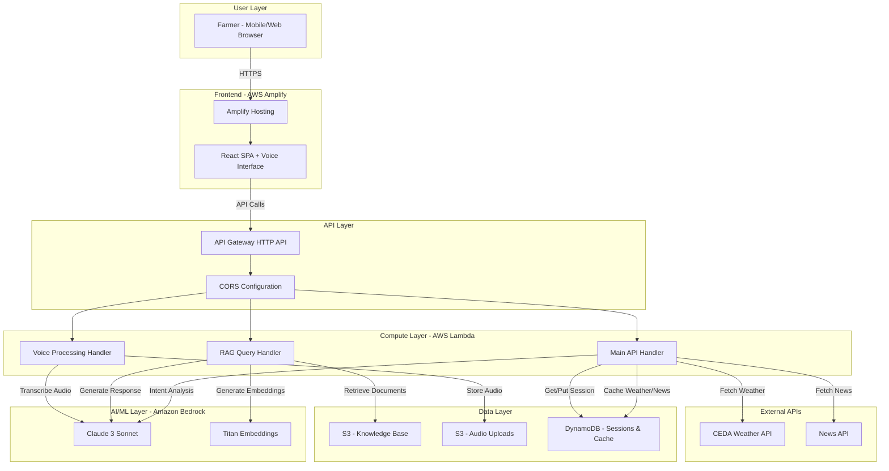

# Design Document: Hackathon AWS Deployment

## Overview

This design transforms the Krishi agricultural advisory application from a local development environment into a production-ready AWS serverless architecture suitable for a 24-hour hackathon demonstration. The deployment leverages AWS Generative AI services (Bedrock), serverless compute (Lambda), managed storage (S3, DynamoDB), and frontend hosting (Amplify) to create a scalable, cost-effective prototype.

The core transformation involves:
- Replacing local AI models with Amazon Bedrock (Claude 3 Sonnet)
- Converting FastAPI backend to Lambda functions behind API Gateway
- Implementing RAG pipeline with S3-based knowledge base and Bedrock embeddings
- Migrating session state to DynamoDB
- Deploying React frontend to Amplify with CI/CD
- Preserving existing voice interface, weather (CEDA), and news integrations

The design prioritizes rapid deployment (< 30 minutes) while maintaining all core functionality for hackathon judges to evaluate AI integration, AWS service usage, and agricultural domain value.

## Architecture

### High-Level Architecture



### Service Interaction Patterns

**Voice Query Flow:**
1. User speaks into browser → Web Speech API captures audio
2. Frontend uploads audio blob to API Gateway `/voice/transcribe`
3. Lambda stores audio in S3, invokes Bedrock for transcription (or uses AWS Transcribe)
4. Transcribed text sent to intent analysis Lambda
5. Intent Lambda queries Bedrock for entity extraction (crop, location, quantity)
6. Main Lambda orchestrates data fetching (weather, prices, news)
7. RAG Lambda retrieves relevant agricultural knowledge from S3
8. Bedrock generates final advisory response with context
9. Response returned to frontend, converted to speech via Web Speech API

**Session Management Flow:**
1. User initiates conversation → Frontend generates/retrieves session ID
2. Each API call includes session ID in headers
3. Lambda queries DynamoDB for conversation history (last 10 turns)
4. After processing, Lambda updates DynamoDB with new interaction
5. Session TTL set to 24 hours for automatic cleanup

**RAG Pipeline Flow:**
1. User query embedded using Bedrock Titan Embeddings
2. Lambda performs similarity search against S3-stored vector index
3. Top 5 relevant documents retrieved from S3
4. Documents + query sent to Bedrock Claude 3 Sonnet with RAG prompt
5. Bedrock generates grounded response citing knowledge base

### AWS Service Rationale

**Amazon Bedrock (Claude 3 Sonnet):**
- Foundation model for natural language understanding in Telugu, Hindi, English
- Entity extraction from unstructured farmer queries
- RAG-based response generation grounded in agricultural knowledge
- No model training required - immediate deployment
- Pay-per-token pricing ideal for hackathon prototype

**AWS Lambda:**
- Zero infrastructure management - focus on code
- Auto-scaling from 0 to N concurrent executions
- 29-second timeout sufficient for API operations
- Cold start < 10 seconds with provisioned concurrency (optional)
- Cost-effective: pay only for execution time

**Amazon API Gateway:**
- Managed HTTP API with automatic scaling
- Built-in CORS support for frontend integration
- Request/response transformation
- CloudWatch logging for debugging
- WebSocket support for future real-time features

**Amazon S3:**
- Knowledge base document storage (PDFs, text files)
- Vector embedding storage for RAG retrieval
- Audio file temporary storage for transcription
- Static asset hosting (alternative to Amplify)
- Versioning for knowledge base updates

**Amazon DynamoDB:**
- Single-digit millisecond latency for session queries
- Flexible schema for conversation history
- TTL for automatic session cleanup
- On-demand pricing - no capacity planning
- Global secondary indexes for user lookups

**AWS Amplify:**
- Git-based CI/CD for frontend
- HTTPS by default with managed certificates
- CDN distribution via CloudFront
- Environment variable management
- Preview deployments for testing

## Components and Interfaces

### Backend Components

#### 1. Lambda Function: Main API Handler (`lambda_main.py`)

**Responsibilities:**
- Route incoming API Gateway requests to appropriate services
- Orchestrate calls to weather, price, and news services
- Manage session state via DynamoDB
- Implement circuit breaker patterns for external API resilience
- Return structured responses to frontend

**Key Methods:**
```python
async def handler(event, context) -> dict:
    """Lambda entry point for API Gateway proxy integration"""
    
async def process_harvest_decision(request: HarvestRequest, session_id: str) -> DecisionResponse:
    """Orchestrate decision support workflow"""
    
async def get_session(session_id: str) -> Session:
    """Retrieve session from DynamoDB"""
    
async def update_session(session_id: str, interaction: Interaction) -> None:
    """Update session history in DynamoDB"""
```

**Dependencies:**
- `boto3` for AWS SDK
- `fastapi` (adapted for Lambda via Mangum adapter)
- Existing services: `ceda_service`, `news_service`, `decision_service`

**Environment Variables:**
- `DYNAMODB_TABLE_SESSIONS`
- `DYNAMODB_TABLE_CACHE`
- `AWS_REGION`
- `CEDA_API_KEY`
- `NEWS_API_KEY`

#### 2. Lambda Function: Voice Processing Handler (`lambda_voice.py`)

**Responsibilities:**
- Accept audio uploads from frontend
- Store audio in S3 for transcription
- Invoke Bedrock for speech-to-text (or AWS Transcribe)
- Extract intent and entities using Bedrock
- Return structured data to main handler

**Key Methods:**
```python
async def handler(event, context) -> dict:
    """Process voice input"""
    
async def transcribe_audio(audio_bytes: bytes, language: str) -> str:
    """Convert audio to text using Bedrock or Transcribe"""
    
async def analyze_intent(transcript: str, language: str) -> IntentData:
    """Extract entities using Bedrock Claude"""
```

**Dependencies:**
- `boto3` (S3, Bedrock, optionally Transcribe)
- `pydantic` for data validation

**Environment Variables:**
- `S3_BUCKET_AUDIO`
- `BEDROCK_MODEL_ID` (default: `anthropic.claude-3-sonnet-20240229-v1:0`)
- `AWS_REGION`

#### 3. Lambda Function: RAG Query Handler (`lambda_rag.py`)

**Responsibilities:**
- Embed user queries using Bedrock Titan Embeddings
- Perform similarity search against S3-stored vector index
- Retrieve top-k relevant documents from S3
- Construct RAG prompt with context
- Invoke Bedrock for grounded response generation

**Key Methods:**
```python
async def handler(event, context) -> dict:
    """Process RAG query"""
    
async def embed_query(query: str) -> List[float]:
    """Generate query embedding using Bedrock Titan"""
    
async def retrieve_documents(embedding: List[float], k: int = 5) -> List[Document]:
    """Similarity search in S3-stored vector index"""
    
async def generate_response(query: str, context: str, history: List[dict]) -> str:
    """Generate RAG response using Bedrock Claude"""
```

**Dependencies:**
- `boto3` (S3, Bedrock)
- `numpy` for vector operations
- `faiss` or simple cosine similarity for vector search

**Environment Variables:**
- `S3_BUCKET_KNOWLEDGE_BASE`
- `S3_KEY_VECTOR_INDEX`
- `BEDROCK_EMBEDDING_MODEL_ID` (default: `amazon.titan-embed-text-v1`)
- `BEDROCK_LLM_MODEL_ID`

#### 4. Service: Bedrock Integration (`bedrock_service.py`)

**Responsibilities:**
- Centralized Bedrock API client
- Prompt engineering for intent extraction, RAG, and response generation
- Token usage tracking for cost monitoring
- Error handling and fallback logic

**Key Methods:**
```python
async def invoke_model(prompt: str, model_id: str, max_tokens: int = 1000) -> str:
    """Invoke Bedrock model with prompt"""
    
async def extract_entities(transcript: str, language: str) -> dict:
    """Extract crop, quantity, location from transcript"""
    
async def generate_advisory(query: str, context: str, data: dict) -> str:
    """Generate agricultural advisory response"""
```

#### 5. Service: DynamoDB Session Manager (`session_service.py`)

**Responsibilities:**
- CRUD operations for user sessions
- Conversation history management (last 10 turns)
- Cache management for weather and news data
- TTL-based cleanup

**Key Methods:**
```python
async def create_session(user_id: str) -> str:
    """Create new session and return session_id"""
    
async def get_session(session_id: str) -> Optional[Session]:
    """Retrieve session by ID"""
    
async def append_interaction(session_id: str, role: str, content: str) -> None:
    """Add interaction to session history"""
    
async def get_cached_data(key: str) -> Optional[dict]:
    """Retrieve cached weather/news data"""
    
async def set_cached_data(key: str, data: dict, ttl_seconds: int) -> None:
    """Cache data with TTL"""
```

#### 6. Service: S3 Knowledge Base Manager (`knowledge_base_service.py`)

**Responsibilities:**
- Upload agricultural documents to S3
- Generate embeddings for documents using Bedrock
- Build and store vector index in S3
- Retrieve documents by similarity

**Key Methods:**
```python
async def upload_document(file_path: str, category: str) -> str:
    """Upload document to S3 knowledge base"""
    
async def generate_embeddings(documents: List[str]) -> List[List[float]]:
    """Generate embeddings for document chunks"""
    
async def build_vector_index(embeddings: List[List[float]], metadata: List[dict]) -> None:
    """Build and upload vector index to S3"""
    
async def search_similar(query_embedding: List[float], k: int) -> List[dict]:
    """Find k most similar documents"""
```

### Frontend Components

#### 1. API Client (`src/services/apiClient.js`)

**Responsibilities:**
- Centralized HTTP client for API Gateway endpoints
- Session ID management (localStorage)
- Request/response interceptors for auth and error handling
- Retry logic for transient failures

**Key Methods:**
```javascript
async function postHarvestDecision(data) { }
async function postVoiceTranscribe(audioBlob, language) { }
async function postRAGQuery(query, sessionId) { }
async function getSession(sessionId) { }
```

**Configuration:**
- `VITE_API_BASE_URL` - API Gateway endpoint
- `VITE_SESSION_TIMEOUT` - Session expiry (24 hours)

#### 2. Voice Interface (`src/components/VoiceOverlay.jsx`)

**Modifications Required:**
- Update API endpoint to API Gateway URL
- Add session ID to all requests
- Handle Bedrock-specific response format
- Maintain existing Web Speech API integration

**No architectural changes** - component remains browser-based for voice capture/playback.

### Data Models

#### Session Model (DynamoDB)

```python
class Session(BaseModel):
    session_id: str  # Partition key
    user_id: Optional[str]
    created_at: datetime
    updated_at: datetime
    ttl: int  # Unix timestamp for DynamoDB TTL
    history: List[Interaction]  # Last 10 turns
    context: dict  # User preferences, location, etc.

class Interaction(BaseModel):
    role: str  # "user" or "assistant"
    content: str
    timestamp: datetime
    metadata: Optional[dict]  # Intent, entities, etc.
```

**DynamoDB Table Schema:**
- Table Name: `krishi-sessions`
- Partition Key: `session_id` (String)
- TTL Attribute: `ttl`
- GSI: `user_id-index` for user lookup

#### Cache Model (DynamoDB)

```python
class CacheEntry(BaseModel):
    cache_key: str  # Partition key (e.g., "weather:Madanapalle")
    data: dict
    created_at: datetime
    ttl: int  # Unix timestamp
```

**DynamoDB Table Schema:**
- Table Name: `krishi-cache`
- Partition Key: `cache_key` (String)
- TTL Attribute: `ttl`

#### Knowledge Base Document Model (S3 Metadata)

```python
class KnowledgeDocument(BaseModel):
    document_id: str
    s3_key: str
    category: str  # "crop_advisory", "pest_management", "market_info"
    title: str
    content_preview: str
    embedding_s3_key: str
    created_at: datetime
    updated_at: datetime
```

**S3 Structure:**
```
s3://krishi-knowledge-base/
├── documents/
│   ├── crop_advisory/
│   │   ├── tomato_cultivation.pdf
│   │   └── onion_storage.md
│   ├── pest_management/
│   └── market_info/
├── embeddings/
│   └── vector_index.pkl
└── metadata/
    └── document_index.json
```

#### Intent Data Model

```python
class IntentData(BaseModel):
    intent: str  # "sell_advice", "market_price", "weather", "unknown"
    crop: Optional[str]
    quantity: Optional[float]
    quantity_unit: str = "quintals"
    location: Optional[str]
    harvest_date: Optional[date]
    confidence: float  # Bedrock confidence score
```

#### RAG Response Model

```python
class RAGResponse(BaseModel):
    answer: str
    sources: List[str]  # Document IDs used
    confidence: float
    token_usage: dict  # For cost tracking
```


## Infrastructure as Code

### AWS SAM Template Structure

The deployment uses AWS SAM (Serverless Application Model) for infrastructure definition:

**Template: `template.yaml`**

```yaml
AWSTemplateFormatVersion: '2010-09-09'
Transform: AWS::Serverless-2016-10-31

Parameters:
  Environment:
    Type: String
    Default: hackathon
  BedrockModelId:
    Type: String
    Default: anthropic.claude-3-sonnet-20240229-v1:0

Globals:
  Function:
    Runtime: python3.11
    Timeout: 29
    MemorySize: 512
    Environment:
      Variables:
        ENVIRONMENT: !Ref Environment
        BEDROCK_MODEL_ID: !Ref BedrockModelId
        DYNAMODB_TABLE_SESSIONS: !Ref SessionsTable
        DYNAMODB_TABLE_CACHE: !Ref CacheTable
        S3_BUCKET_KNOWLEDGE_BASE: !Ref KnowledgeBaseBucket
        S3_BUCKET_AUDIO: !Ref AudioBucket

Resources:
  # API Gateway
  KrishiAPI:
    Type: AWS::Serverless::HttpApi
    Properties:
      CorsConfiguration:
        AllowOrigins: ["*"]
        AllowMethods: [GET, POST, PUT, DELETE, OPTIONS]
        AllowHeaders: ["*"]
  
  # Lambda Functions
  MainAPIFunction:
    Type: AWS::Serverless::Function
    Properties:
      CodeUri: lambda/main/
      Handler: handler.lambda_handler
      Policies:
        - DynamoDBCrudPolicy:
            TableName: !Ref SessionsTable
        - DynamoDBCrudPolicy:
            TableName: !Ref CacheTable
        - Statement:
            - Effect: Allow
              Action: bedrock:InvokeModel
              Resource: "*"
      Events:
        ApiEvent:
          Type: HttpApi
          Properties:
            ApiId: !Ref KrishiAPI
            Path: /api/v1/{proxy+}
            Method: ANY
  
  VoiceFunction:
    Type: AWS::Serverless::Function
    Properties:
      CodeUri: lambda/voice/
      Handler: handler.lambda_handler
      Policies:
        - S3CrudPolicy:
            BucketName: !Ref AudioBucket
        - Statement:
            - Effect: Allow
              Action: bedrock:InvokeModel
              Resource: "*"
      Events:
        VoiceEvent:
          Type: HttpApi
          Properties:
            ApiId: !Ref KrishiAPI
            Path: /api/v1/voice/{proxy+}
            Method: POST
  
  RAGFunction:
    Type: AWS::Serverless::Function
    Properties:
      CodeUri: lambda/rag/
      Handler: handler.lambda_handler
      Timeout: 60
      MemorySize: 1024
      Policies:
        - S3ReadPolicy:
            BucketName: !Ref KnowledgeBaseBucket
        - Statement:
            - Effect: Allow
              Action: bedrock:InvokeModel
              Resource: "*"
      Events:
        RAGEvent:
          Type: HttpApi
          Properties:
            ApiId: !Ref KrishiAPI
            Path: /api/v1/rag/query
            Method: POST
  
  # DynamoDB Tables
  SessionsTable:
    Type: AWS::DynamoDB::Table
    Properties:
      TableName: krishi-sessions
      BillingMode: PAY_PER_REQUEST
      AttributeDefinitions:
        - AttributeName: session_id
          AttributeType: S
        - AttributeName: user_id
          AttributeType: S
      KeySchema:
        - AttributeName: session_id
          KeyType: HASH
      GlobalSecondaryIndexes:
        - IndexName: user_id-index
          KeySchema:
            - AttributeName: user_id
              KeyType: HASH
          Projection:
            ProjectionType: ALL
      TimeToLiveSpecification:
        Enabled: true
        AttributeName: ttl
  
  CacheTable:
    Type: AWS::DynamoDB::Table
    Properties:
      TableName: krishi-cache
      BillingMode: PAY_PER_REQUEST
      AttributeDefinitions:
        - AttributeName: cache_key
          AttributeType: S
      KeySchema:
        - AttributeName: cache_key
          KeyType: HASH
      TimeToLiveSpecification:
        Enabled: true
        AttributeName: ttl
  
  # S3 Buckets
  KnowledgeBaseBucket:
    Type: AWS::S3::Bucket
    Properties:
      BucketName: !Sub krishi-knowledge-base-${AWS::AccountId}
      PublicAccessBlockConfiguration:
        BlockPublicAcls: true
        BlockPublicPolicy: true
        IgnorePublicAcls: true
        RestrictPublicBuckets: true
      VersioningConfiguration:
        Status: Enabled
  
  AudioBucket:
    Type: AWS::S3::Bucket
    Properties:
      BucketName: !Sub krishi-audio-${AWS::AccountId}
      PublicAccessBlockConfiguration:
        BlockPublicAcls: true
        BlockPublicPolicy: true
        IgnorePublicAcls: true
        RestrictPublicBuckets: true
      LifecycleConfiguration:
        Rules:
          - Id: DeleteOldAudio
            Status: Enabled
            ExpirationInDays: 1

Outputs:
  ApiEndpoint:
    Description: API Gateway endpoint URL
    Value: !Sub https://${KrishiAPI}.execute-api.${AWS::Region}.amazonaws.com
  SessionsTableName:
    Description: DynamoDB Sessions Table
    Value: !Ref SessionsTable
  KnowledgeBaseBucketName:
    Description: S3 Knowledge Base Bucket
    Value: !Ref KnowledgeBaseBucket
```

### Deployment Scripts

#### 1. Main Deployment Script (`deploy.sh`)

```bash
#!/bin/bash
set -e

echo "🚀 Starting Krishi AWS Deployment..."

# Configuration
STACK_NAME="krishi-hackathon"
REGION="ap-south-1"
S3_DEPLOY_BUCKET="krishi-deployment-artifacts"

# Step 1: Package Lambda functions
echo "📦 Packaging Lambda functions..."
cd lambda/main && pip install -r requirements.txt -t . && cd ../..
cd lambda/voice && pip install -r requirements.txt -t . && cd ../..
cd lambda/rag && pip install -r requirements.txt -t . && cd ../..

# Step 2: Build SAM application
echo "🔨 Building SAM application..."
sam build

# Step 3: Deploy to AWS
echo "☁️  Deploying to AWS..."
sam deploy \
  --stack-name $STACK_NAME \
  --region $REGION \
  --capabilities CAPABILITY_IAM \
  --s3-bucket $S3_DEPLOY_BUCKET \
  --no-confirm-changeset \
  --no-fail-on-empty-changeset

# Step 4: Get API endpoint
API_ENDPOINT=$(aws cloudformation describe-stacks \
  --stack-name $STACK_NAME \
  --region $REGION \
  --query 'Stacks[0].Outputs[?OutputKey==`ApiEndpoint`].OutputValue' \
  --output text)

echo "✅ Backend deployed successfully!"
echo "📍 API Endpoint: $API_ENDPOINT"

# Step 5: Upload knowledge base
echo "📚 Uploading knowledge base..."
KB_BUCKET=$(aws cloudformation describe-stacks \
  --stack-name $STACK_NAME \
  --region $REGION \
  --query 'Stacks[0].Outputs[?OutputKey==`KnowledgeBaseBucketName`].OutputValue' \
  --output text)

aws s3 sync ./knowledge_base/ s3://$KB_BUCKET/documents/ --region $REGION

# Step 6: Generate embeddings
echo "🧠 Generating embeddings..."
python scripts/generate_embeddings.py --bucket $KB_BUCKET --region $REGION

# Step 7: Deploy frontend
echo "🎨 Deploying frontend to Amplify..."
cd frontend
echo "VITE_API_BASE_URL=$API_ENDPOINT" > .env.production
npm run build

# Amplify deployment (assumes Amplify app already created)
# Manual step: Connect GitHub repo to Amplify in AWS Console
# Or use Amplify CLI:
# amplify publish

echo "✅ Deployment complete!"
echo "🌐 Frontend: Check Amplify Console for URL"
echo "📊 Monitor: CloudWatch Logs"
```

#### 2. Knowledge Base Setup Script (`scripts/generate_embeddings.py`)

```python
import boto3
import json
import numpy as np
from pathlib import Path
import argparse

def generate_embeddings(bucket_name, region):
    """Generate embeddings for all documents in knowledge base"""
    s3 = boto3.client('s3', region_name=region)
    bedrock = boto3.client('bedrock-runtime', region_name=region)
    
    # List all documents
    response = s3.list_objects_v2(Bucket=bucket_name, Prefix='documents/')
    documents = []
    embeddings = []
    
    for obj in response.get('Contents', []):
        key = obj['Key']
        if key.endswith(('.txt', '.md')):
            # Download document
            content = s3.get_object(Bucket=bucket_name, Key=key)['Body'].read().decode('utf-8')
            
            # Chunk document (simple split for MVP)
            chunks = [content[i:i+1000] for i in range(0, len(content), 800)]
            
            for chunk in chunks:
                # Generate embedding using Bedrock Titan
                response = bedrock.invoke_model(
                    modelId='amazon.titan-embed-text-v1',
                    body=json.dumps({"inputText": chunk})
                )
                embedding = json.loads(response['body'].read())['embedding']
                
                documents.append({
                    'content': chunk,
                    's3_key': key,
                    'embedding': embedding
                })
                embeddings.append(embedding)
    
    # Build simple vector index
    index_data = {
        'documents': documents,
        'embeddings': np.array(embeddings).tolist()
    }
    
    # Upload to S3
    s3.put_object(
        Bucket=bucket_name,
        Key='embeddings/vector_index.json',
        Body=json.dumps(index_data)
    )
    
    print(f"✅ Generated embeddings for {len(documents)} chunks")

if __name__ == '__main__':
    parser = argparse.ArgumentParser()
    parser.add_argument('--bucket', required=True)
    parser.add_argument('--region', default='ap-south-1')
    args = parser.parse_args()
    
    generate_embeddings(args.bucket, args.region)
```

#### 3. Rollback Script (`rollback.sh`)

```bash
#!/bin/bash
set -e

STACK_NAME="krishi-hackathon"
REGION="ap-south-1"

echo "⚠️  Rolling back deployment..."

# Delete CloudFormation stack
aws cloudformation delete-stack \
  --stack-name $STACK_NAME \
  --region $REGION

# Wait for deletion
aws cloudformation wait stack-delete-complete \
  --stack-name $STACK_NAME \
  --region $REGION

echo "✅ Rollback complete"
```

### Amplify Configuration

**File: `amplify.yml`**

```yaml
version: 1
frontend:
  phases:
    preBuild:
      commands:
        - npm ci
    build:
      commands:
        - npm run build
  artifacts:
    baseDirectory: dist
    files:
      - '**/*'
  cache:
    paths:
      - node_modules/**/*
```

**Environment Variables (Amplify Console):**
- `VITE_API_BASE_URL` - API Gateway endpoint from CloudFormation outputs
- `VITE_SESSION_TIMEOUT` - 86400 (24 hours)


## Correctness Properties

*A property is a characteristic or behavior that should hold true across all valid executions of a system-essentially, a formal statement about what the system should do. Properties serve as the bridge between human-readable specifications and machine-verifiable correctness guarantees.*

### Property Reflection

After analyzing all acceptance criteria, I identified the following redundancies and consolidations:

**Redundancies Eliminated:**
- Properties 6.1-6.5 (Voice Interface behaviors) are subsumed by Property 5.4 (maintain existing Voice_Interface functionality) - testing the overall voice interface preservation covers individual steps
- Properties 2.4 and 7.1 overlap (CEDA integration) - consolidated into single property
- Properties 2.5 and 8.1 overlap (News integration) - consolidated into single property
- Properties 1.2 and 1.3 can be combined into a single RAG pipeline property
- Properties 13.1-13.4 (metrics emission) can be consolidated into a single comprehensive metrics property

**Properties Combined:**
- Session persistence (4.1) and session updates (4.3) combined into session round-trip property
- Weather caching (7.4) and news caching (8.4) combined into general caching property with TTL validation
- Error logging (12.4) and error messages (12.5) combined into comprehensive error handling property

### Property 1: RAG Pipeline Retrieval and Response

*For any* user query submitted to the RAG pipeline, the system SHALL retrieve relevant context from the knowledge base AND generate a response using that context.

**Validates: Requirements 1.2, 1.3**

### Property 2: Session Context Preservation

*For any* user session with multiple interactions, later interactions SHALL have access to the conversation history from earlier interactions in that session.

**Validates: Requirements 1.5**

### Property 3: API Gateway Routing

*For any* valid HTTP request path, the API Gateway SHALL route the request to the correct Lambda function handler.

**Validates: Requirements 2.2**

### Property 4: Lambda Timeout Compliance

*For any* API request processed by Lambda functions, the processing SHALL complete within 29 seconds.

**Validates: Requirements 2.3**

### Property 5: CEDA Integration Preservation

*For any* weather query, the Lambda-based implementation SHALL return results equivalent to the original local implementation.

**Validates: Requirements 2.4, 7.2**

### Property 6: News Integration Preservation

*For any* news query, the Lambda-based implementation SHALL return results equivalent to the original local implementation.

**Validates: Requirements 2.5, 8.2**

### Property 7: Knowledge Base Embedding Regeneration

*For any* update to the knowledge base documents, the system SHALL regenerate embeddings for the updated content.

**Validates: Requirements 3.3**

### Property 8: S3 Retrieval Performance

*For any* document retrieval request from S3, the operation SHALL complete within 2 seconds.

**Validates: Requirements 3.4**

### Property 9: Session Persistence Round-Trip

*For any* session data written to DynamoDB, retrieving that session SHALL return the same data including all interaction history.

**Validates: Requirements 4.1, 4.3**

### Property 10: Session Initialization

*For any* user starting an interaction, a valid session SHALL exist (either created or retrieved) before processing the first query.

**Validates: Requirements 4.2**

### Property 11: DynamoDB Query Performance

*For any* session query by user identifier, the DynamoDB operation SHALL complete within 100ms.

**Validates: Requirements 4.4**

### Property 12: Session History Size Limit

*For any* session with more than 10 interactions, the session SHALL maintain exactly the last 10 interactions and discard older ones.

**Validates: Requirements 4.5**

### Property 13: Voice Interface Preservation

*For any* voice interaction (speech input to speech output), the AWS-deployed implementation SHALL function identically to the existing local implementation.

**Validates: Requirements 5.4, 6.1, 6.2, 6.3, 6.4, 6.5**

### Property 14: Weather Data Fallback

*For any* weather data request, IF the CEDA API fails THEN the system SHALL return cached weather data from DynamoDB.

**Validates: Requirements 7.3**

### Property 15: News Data Fallback

*For any* news data request, IF the News API fails THEN the system SHALL return cached news data from DynamoDB.

**Validates: Requirements 8.3**

### Property 16: Cache TTL Validation

*For any* data cached in DynamoDB (weather or news), the cache entry SHALL have the correct TTL (1 hour for weather, 6 hours for news) and SHALL be automatically deleted after expiration.

**Validates: Requirements 7.4, 8.4**

### Property 17: Weather Data in Advisory

*For any* advisory response generated when weather data is available, the response SHALL incorporate weather information in the recommendation.

**Validates: Requirements 7.5**

### Property 18: News Data in Advisory

*For any* advisory response generated when market news is available, the response SHALL incorporate news information in the recommendation.

**Validates: Requirements 8.5**

### Property 19: Query Embedding

*For any* user query submitted to the RAG pipeline, the query SHALL be embedded using Bedrock Titan Embeddings before retrieval.

**Validates: Requirements 11.1**

### Property 20: Top-K Document Retrieval

*For any* embedded query, the RAG pipeline SHALL retrieve exactly 5 relevant documents from S3.

**Validates: Requirements 11.2**

### Property 21: Prompt Context Construction

*For any* set of retrieved documents, the RAG pipeline SHALL construct a prompt that includes the document content as context.

**Validates: Requirements 11.3**

### Property 22: Context-Grounded Response

*For any* RAG prompt with retrieved context, the Bedrock response SHALL reference or be grounded in the provided context.

**Validates: Requirements 11.4**

### Property 23: Query Reformulation Equivalence

*For any* valid query, processing the query then reformulating it then processing again SHALL produce semantically equivalent responses.

**Validates: Requirements 11.5**

### Property 24: Bedrock Fallback

*For any* request, IF Bedrock is unavailable THEN the system SHALL return a fallback response without failing.

**Validates: Requirements 12.1**

### Property 25: DynamoDB Degraded Operation

*For any* request, IF DynamoDB is unavailable THEN the system SHALL continue to operate without session persistence.

**Validates: Requirements 12.2**

### Property 26: S3 Knowledge Cache Fallback

*For any* RAG query, IF S3 is unavailable THEN the system SHALL use cached knowledge from previous retrievals.

**Validates: Requirements 12.3**

### Property 27: Comprehensive Error Handling

*For any* error that occurs during request processing, the system SHALL log the error to CloudWatch AND return a user-friendly error message to the client.

**Validates: Requirements 12.4, 12.5**

### Property 28: Comprehensive Metrics Emission

*For any* system operation (Lambda execution, API request, Bedrock invocation, DynamoDB operation), the system SHALL emit appropriate metrics to CloudWatch.

**Validates: Requirements 13.1, 13.2, 13.3, 13.4**

### Property 29: CORS Policy Enforcement

*For any* cross-origin HTTP request to the API Gateway, the system SHALL enforce CORS policies and only allow requests from the configured frontend origin.

**Validates: Requirements 14.2**

### Property 30: Concurrent User Support

*For any* demonstration scenario with up to 10 concurrent users, the system SHALL successfully process all user requests without degradation.

**Validates: Requirements 15.4**


## Error Handling

### Error Categories and Strategies

#### 1. AWS Service Failures

**Bedrock Unavailability:**
- Detection: Catch `ServiceUnavailableException`, `ThrottlingException`
- Fallback: Return rule-based response using existing decision engine
- User Message: "AI service temporarily unavailable. Using basic advisory mode."
- Logging: CloudWatch error log with service status

**DynamoDB Unavailability:**
- Detection: Catch `ServiceUnavailableException`, connection timeouts
- Fallback: Operate in stateless mode without session persistence
- User Message: "Session history temporarily unavailable. Continuing without context."
- Logging: CloudWatch error log with retry attempts

**S3 Unavailability:**
- Detection: Catch `NoSuchBucket`, `ServiceUnavailableException`
- Fallback: Use in-memory cached knowledge base (last successful retrieval)
- User Message: "Knowledge base temporarily unavailable. Using cached information."
- Logging: CloudWatch error log with cache hit/miss status

**API Gateway Errors:**
- 4xx errors: Return structured error response with validation details
- 5xx errors: Trigger automatic retry with exponential backoff
- Timeout: Return partial response if available, otherwise error message
- Logging: Request ID, path, method, status code to CloudWatch

#### 2. External API Failures

**CEDA Weather API:**
- Circuit Breaker: Open after 3 consecutive failures, half-open after 60 seconds
- Fallback: Return cached weather data from DynamoDB (1-hour TTL)
- User Message: "Using recent weather data (cached [X] minutes ago)."
- Retry Strategy: Exponential backoff with max 3 retries

**News API:**
- Circuit Breaker: Open after 3 consecutive failures, half-open after 60 seconds
- Fallback: Return cached news data from DynamoDB (6-hour TTL)
- User Message: "Using recent market news (cached [X] hours ago)."
- Retry Strategy: Exponential backoff with max 3 retries

#### 3. Data Validation Errors

**Invalid User Input:**
- Validation: Pydantic models with field constraints
- Response: 400 Bad Request with specific field errors
- User Message: "Please provide valid [field_name]: [constraint_description]"
- Example: "Please provide valid quantity: must be a positive number"

**Missing Required Fields:**
- Validation: Check required fields before processing
- Response: 400 Bad Request with missing field list
- User Message: "Required information missing: [field_list]"

**Malformed Audio Data:**
- Validation: Check audio format, size, duration
- Response: 400 Bad Request with format requirements
- User Message: "Audio format not supported. Please use WAV format, max 10MB, max 60 seconds."

#### 4. Lambda-Specific Errors

**Cold Start Timeout:**
- Mitigation: Provisioned concurrency for critical functions (optional)
- Monitoring: CloudWatch metric for cold start duration
- Alert: If cold start > 10 seconds, trigger investigation

**Memory Exhaustion:**
- Detection: Monitor Lambda memory usage metrics
- Mitigation: Increase memory allocation in SAM template
- Fallback: Return error with request ID for debugging
- User Message: "Request processing failed. Please try again. Reference: [request_id]"

**Timeout (29 seconds):**
- Detection: Lambda timeout exception
- Mitigation: Break long operations into smaller chunks
- Response: 504 Gateway Timeout
- User Message: "Request is taking longer than expected. Please try again."

#### 5. RAG Pipeline Errors

**No Relevant Documents Found:**
- Detection: Similarity score below threshold (< 0.3)
- Fallback: Use general agricultural knowledge prompt without specific context
- User Message: "I don't have specific information about that. Here's general advice..."

**Embedding Generation Failure:**
- Detection: Bedrock embedding API error
- Fallback: Use keyword-based search in S3
- Logging: Error details to CloudWatch

**Vector Index Corruption:**
- Detection: JSON parse error, invalid array dimensions
- Fallback: Rebuild index from S3 documents (background task)
- User Message: "Knowledge base temporarily unavailable. Please try again in a few minutes."

### Error Response Format

All API errors follow a consistent JSON structure:

```json
{
  "error": {
    "code": "SERVICE_UNAVAILABLE",
    "message": "AI service temporarily unavailable. Using basic advisory mode.",
    "details": {
      "service": "bedrock",
      "timestamp": "2024-01-15T10:30:00Z",
      "request_id": "abc123-def456"
    },
    "fallback_used": true
  },
  "data": {
    // Partial or fallback data if available
  }
}
```

### Logging Strategy

**CloudWatch Log Groups:**
- `/aws/lambda/krishi-main-api` - Main API handler logs
- `/aws/lambda/krishi-voice` - Voice processing logs
- `/aws/lambda/krishi-rag` - RAG pipeline logs

**Log Levels:**
- ERROR: Service failures, unhandled exceptions
- WARN: Fallback activations, circuit breaker state changes
- INFO: Request processing, cache hits/misses
- DEBUG: Detailed execution flow (disabled in production)

**Structured Logging Format:**
```json
{
  "timestamp": "2024-01-15T10:30:00Z",
  "level": "ERROR",
  "service": "bedrock",
  "operation": "invoke_model",
  "request_id": "abc123",
  "session_id": "user-session-456",
  "error": "ServiceUnavailableException",
  "fallback": "rule_based_response",
  "duration_ms": 1250
}
```

### Monitoring and Alerts

**CloudWatch Alarms:**
- Lambda error rate > 5% in 5 minutes → SNS notification
- API Gateway 5xx rate > 10% in 5 minutes → SNS notification
- DynamoDB throttled requests > 0 → SNS notification
- Bedrock token usage > 80% of budget → SNS notification

**Dashboard Metrics:**
- Request success/failure rates
- Average response time by endpoint
- Cache hit rates (weather, news, knowledge base)
- Bedrock token usage and cost
- Lambda cold start frequency

## Testing Strategy

### Dual Testing Approach

The testing strategy employs both unit tests and property-based tests to ensure comprehensive coverage:

**Unit Tests:**
- Specific examples demonstrating correct behavior
- Edge cases (empty inputs, boundary values, malformed data)
- Error conditions (service failures, timeouts, invalid data)
- Integration points between components

**Property-Based Tests:**
- Universal properties that hold for all inputs
- Comprehensive input coverage through randomization
- Minimum 100 iterations per property test
- Each test references its design document property

Together, unit tests catch concrete bugs while property tests verify general correctness across the input space.

### Property-Based Testing Configuration

**Framework:** Hypothesis (Python)

**Configuration:**
```python
from hypothesis import given, settings, strategies as st

@settings(max_examples=100, deadline=5000)  # 100 iterations, 5s timeout
@given(
    query=st.text(min_size=1, max_size=500),
    language=st.sampled_from(['en', 'te', 'hi'])
)
def test_property_1_rag_retrieval_and_response(query, language):
    """
    Feature: hackathon-aws-deployment, Property 1: 
    For any user query, RAG pipeline SHALL retrieve context AND generate response
    """
    # Test implementation
```

**Test Tagging Convention:**
All property tests include a docstring with the format:
```
Feature: {feature_name}, Property {number}: {property_text}
```

### Test Organization

```
tests/
├── unit/
│   ├── test_lambda_handlers.py
│   ├── test_bedrock_service.py
│   ├── test_session_service.py
│   ├── test_knowledge_base_service.py
│   └── test_error_handling.py
├── properties/
│   ├── test_rag_properties.py
│   ├── test_session_properties.py
│   ├── test_integration_properties.py
│   └── test_performance_properties.py
├── integration/
│   ├── test_api_gateway_integration.py
│   ├── test_voice_workflow.py
│   └── test_end_to_end.py
└── load/
    └── test_concurrent_users.py
```

### Unit Test Coverage

#### Lambda Handler Tests

**test_lambda_handlers.py:**
- Test API Gateway event parsing
- Test response formatting
- Test routing to correct service methods
- Test error response structure
- Test CORS headers in responses

**Example:**
```python
def test_main_handler_routes_harvest_decision():
    """Test that /api/v1/harvest/decision routes to decision service"""
    event = {
        'httpMethod': 'POST',
        'path': '/api/v1/harvest/decision',
        'body': json.dumps({
            'crop': 'Tomato',
            'quantity': 50,
            'location': 'Madanapalle'
        })
    }
    response = lambda_main.handler(event, {})
    assert response['statusCode'] == 200
    assert 'decision' in json.loads(response['body'])
```

#### Bedrock Service Tests

**test_bedrock_service.py:**
- Test entity extraction from various transcript formats
- Test RAG prompt construction
- Test response parsing from Bedrock
- Test fallback when Bedrock unavailable
- Test token usage tracking

**Example:**
```python
def test_extract_entities_telugu_input():
    """Test entity extraction from Telugu transcript"""
    transcript = "నా దగ్గర మదనపల్లెలో 50 క్వింటాళ్ల టమాటా ఉంది"
    result = bedrock_service.extract_entities(transcript, 'te')
    assert result['crop'] == 'Tomato'
    assert result['quantity'] == 50
    assert result['location'] == 'Madanapalle'
```

#### Session Service Tests

**test_session_service.py:**
- Test session creation
- Test session retrieval
- Test interaction appending
- Test history size limit (10 interactions)
- Test TTL setting
- Test cache operations

**Example:**
```python
def test_session_history_limit():
    """Test that session maintains only last 10 interactions"""
    session_id = session_service.create_session('user123')
    
    # Add 15 interactions
    for i in range(15):
        session_service.append_interaction(
            session_id, 
            'user', 
            f'Query {i}'
        )
    
    session = session_service.get_session(session_id)
    assert len(session.history) == 10
    assert session.history[0].content == 'Query 5'  # Oldest kept
    assert session.history[-1].content == 'Query 14'  # Newest
```

#### Error Handling Tests

**test_error_handling.py:**
- Test Bedrock fallback activation
- Test DynamoDB fallback (stateless mode)
- Test S3 fallback (cached knowledge)
- Test circuit breaker state transitions
- Test error response formatting
- Test CloudWatch logging

**Example:**
```python
def test_bedrock_fallback_on_service_unavailable():
    """Test fallback to rule-based response when Bedrock fails"""
    with mock.patch('boto3.client') as mock_client:
        mock_client.return_value.invoke_model.side_effect = \
            ServiceUnavailableException()
        
        response = bedrock_service.generate_advisory(
            query="Should I sell tomatoes?",
            context="",
            data={'crop': 'Tomato', 'quantity': 50}
        )
        
        assert 'fallback' in response.lower()
        assert response != ""  # Should still return something
```

### Property-Based Test Coverage

#### RAG Properties

**test_rag_properties.py:**

```python
@settings(max_examples=100)
@given(
    query=st.text(min_size=1, max_size=500),
    language=st.sampled_from(['en', 'te', 'hi'])
)
def test_property_1_rag_retrieval_and_response(query, language):
    """
    Feature: hackathon-aws-deployment, Property 1:
    For any user query, RAG pipeline SHALL retrieve context AND generate response
    """
    result = rag_service.process_query(query, language)
    
    assert result.context is not None, "Context should be retrieved"
    assert len(result.context) > 0, "Context should not be empty"
    assert result.response is not None, "Response should be generated"
    assert len(result.response) > 0, "Response should not be empty"

@settings(max_examples=100)
@given(
    query=st.text(min_size=1, max_size=500)
)
def test_property_20_top_k_retrieval(query):
    """
    Feature: hackathon-aws-deployment, Property 20:
    For any embedded query, RAG SHALL retrieve exactly 5 documents
    """
    embedding = rag_service.embed_query(query)
    documents = rag_service.retrieve_documents(embedding)
    
    assert len(documents) == 5, f"Expected 5 documents, got {len(documents)}"

@settings(max_examples=100)
@given(
    query=st.text(min_size=10, max_size=200)
)
def test_property_23_query_reformulation_equivalence(query):
    """
    Feature: hackathon-aws-deployment, Property 23:
    For any query, process -> reformulate -> process SHALL produce equivalent responses
    """
    # First processing
    response1 = rag_service.process_query(query, 'en')
    
    # Reformulate query (paraphrase)
    reformulated = bedrock_service.reformulate_query(query)
    
    # Second processing
    response2 = rag_service.process_query(reformulated, 'en')
    
    # Check semantic equivalence (using embedding similarity)
    similarity = compute_semantic_similarity(response1.response, response2.response)
    assert similarity > 0.7, f"Responses not semantically equivalent: {similarity}"
```

#### Session Properties

**test_session_properties.py:**

```python
@settings(max_examples=100)
@given(
    user_id=st.text(min_size=1, max_size=50),
    interactions=st.lists(
        st.tuples(
            st.sampled_from(['user', 'assistant']),
            st.text(min_size=1, max_size=200)
        ),
        min_size=2,
        max_size=20
    )
)
def test_property_2_session_context_preservation(user_id, interactions):
    """
    Feature: hackathon-aws-deployment, Property 2:
    For any session with multiple interactions, later interactions SHALL have access to earlier context
    """
    session_id = session_service.create_session(user_id)
    
    # Add all interactions
    for role, content in interactions:
        session_service.append_interaction(session_id, role, content)
    
    # Retrieve session
    session = session_service.get_session(session_id)
    
    # Verify all interactions are accessible (up to last 10)
    expected_count = min(len(interactions), 10)
    assert len(session.history) == expected_count
    
    # Verify order is preserved
    for i, (role, content) in enumerate(interactions[-expected_count:]):
        assert session.history[i].role == role
        assert session.history[i].content == content

@settings(max_examples=100)
@given(
    session_data=st.fixed_dictionaries({
        'user_id': st.text(min_size=1, max_size=50),
        'history': st.lists(
            st.fixed_dictionaries({
                'role': st.sampled_from(['user', 'assistant']),
                'content': st.text(min_size=1, max_size=200)
            }),
            max_size=10
        )
    })
)
def test_property_9_session_persistence_round_trip(session_data):
    """
    Feature: hackathon-aws-deployment, Property 9:
    For any session data written, retrieving SHALL return the same data
    """
    # Create session
    session_id = session_service.create_session(session_data['user_id'])
    
    # Add interactions
    for interaction in session_data['history']:
        session_service.append_interaction(
            session_id,
            interaction['role'],
            interaction['content']
        )
    
    # Retrieve session
    retrieved = session_service.get_session(session_id)
    
    # Verify round-trip
    assert retrieved.user_id == session_data['user_id']
    assert len(retrieved.history) == len(session_data['history'])
    for i, interaction in enumerate(session_data['history']):
        assert retrieved.history[i].role == interaction['role']
        assert retrieved.history[i].content == interaction['content']
```

#### Integration Properties

**test_integration_properties.py:**

```python
@settings(max_examples=100)
@given(
    location=st.text(min_size=1, max_size=50)
)
def test_property_14_weather_fallback(location):
    """
    Feature: hackathon-aws-deployment, Property 14:
    For any weather request, IF CEDA fails THEN return cached data
    """
    # First request - populate cache
    weather1 = weather_service.get_weather(location)
    
    # Simulate CEDA failure
    with mock.patch.object(weather_service, '_fetch_from_ceda', side_effect=Exception("API Down")):
        weather2 = weather_service.get_weather(location)
    
    # Should return cached data
    assert weather2 is not None, "Should return cached data on failure"
    assert weather2 == weather1, "Cached data should match original"

@settings(max_examples=100)
@given(
    crop=st.sampled_from(['Tomato', 'Onion', 'Potato', 'Rice']),
    quantity=st.floats(min_value=1, max_value=1000),
    location=st.text(min_size=1, max_size=50)
)
def test_property_5_ceda_integration_preservation(crop, quantity, location):
    """
    Feature: hackathon-aws-deployment, Property 5:
    For any weather query, Lambda SHALL return equivalent results to original
    """
    # Call original implementation
    original_result = original_weather_service.get_weather(location)
    
    # Call Lambda implementation
    lambda_result = lambda_weather_service.get_weather(location)
    
    # Verify equivalence
    assert lambda_result.temperature == original_result.temperature
    assert lambda_result.conditions == original_result.conditions
```

#### Performance Properties

**test_performance_properties.py:**

```python
@settings(max_examples=100)
@given(
    request_data=st.fixed_dictionaries({
        'crop': st.sampled_from(['Tomato', 'Onion']),
        'quantity': st.floats(min_value=1, max_value=1000),
        'location': st.text(min_size=1, max_size=50)
    })
)
def test_property_4_lambda_timeout_compliance(request_data):
    """
    Feature: hackathon-aws-deployment, Property 4:
    For any API request, Lambda SHALL process within 29 seconds
    """
    start_time = time.time()
    
    response = lambda_handler.process_request(request_data)
    
    duration = time.time() - start_time
    assert duration < 29, f"Request took {duration}s, exceeds 29s limit"
    assert response is not None

@settings(max_examples=100)
@given(
    session_id=st.text(min_size=1, max_size=50)
)
def test_property_11_dynamodb_query_performance(session_id):
    """
    Feature: hackathon-aws-deployment, Property 11:
    For any session query, DynamoDB SHALL complete within 100ms
    """
    # Create session first
    session_service.create_session_with_id(session_id, 'user123')
    
    start_time = time.time()
    session = session_service.get_session(session_id)
    duration = (time.time() - start_time) * 1000  # Convert to ms
    
    assert duration < 100, f"Query took {duration}ms, exceeds 100ms limit"
    assert session is not None
```

### Integration Tests

**test_end_to_end.py:**
- Test complete voice query workflow
- Test RAG pipeline end-to-end
- Test session management across multiple requests
- Test error recovery scenarios

**Example:**
```python
def test_complete_voice_advisory_workflow():
    """Test full workflow from voice input to advisory response"""
    # 1. Upload audio
    with open('test_audio/tomato_query_telugu.wav', 'rb') as f:
        audio_data = f.read()
    
    transcribe_response = requests.post(
        f"{API_BASE_URL}/api/v1/voice/transcribe",
        files={'audio': audio_data},
        headers={'X-Session-ID': 'test-session-123'}
    )
    assert transcribe_response.status_code == 200
    transcript = transcribe_response.json()['transcript']
    
    # 2. Get advisory
    advisory_response = requests.post(
        f"{API_BASE_URL}/api/v1/harvest/decision",
        json={
            'transcript': transcript,
            'language': 'te'
        },
        headers={'X-Session-ID': 'test-session-123'}
    )
    assert advisory_response.status_code == 200
    advisory = advisory_response.json()
    
    # 3. Verify response structure
    assert 'decision' in advisory
    assert 'reasoning' in advisory
    assert 'sources' in advisory
    
    # 4. Verify session updated
    session_response = requests.get(
        f"{API_BASE_URL}/api/v1/session/test-session-123"
    )
    session = session_response.json()
    assert len(session['history']) >= 2  # User query + assistant response
```

### Load Testing

**test_concurrent_users.py:**

```python
def test_property_30_concurrent_user_support():
    """
    Feature: hackathon-aws-deployment, Property 30:
    System SHALL support 10 concurrent users
    """
    import concurrent.futures
    
    def simulate_user(user_id):
        session_id = f"load-test-{user_id}"
        
        # Make multiple requests
        for i in range(5):
            response = requests.post(
                f"{API_BASE_URL}/api/v1/harvest/decision",
                json={
                    'crop': 'Tomato',
                    'quantity': 50,
                    'location': 'Madanapalle'
                },
                headers={'X-Session-ID': session_id}
            )
            assert response.status_code == 200
        
        return user_id
    
    # Simulate 10 concurrent users
    with concurrent.futures.ThreadPoolExecutor(max_workers=10) as executor:
        futures = [executor.submit(simulate_user, i) for i in range(10)]
        results = [f.result() for f in concurrent.futures.as_completed(futures)]
    
    assert len(results) == 10, "All users should complete successfully"
```

### Test Execution

**Local Testing:**
```bash
# Unit tests
pytest tests/unit/ -v

# Property tests
pytest tests/properties/ -v --hypothesis-show-statistics

# Integration tests (requires deployed stack)
export API_BASE_URL=https://xxx.execute-api.ap-south-1.amazonaws.com
pytest tests/integration/ -v

# Load tests
pytest tests/load/ -v
```

**CI/CD Integration:**
- Unit and property tests run on every commit
- Integration tests run on deployment to staging
- Load tests run before production deployment
- Test coverage target: 80% for unit tests, 100% property coverage

### Cost Estimation

**24-Hour Hackathon Prototype Operation:**

| Service | Usage | Cost |
|---------|-------|------|
| Amazon Bedrock (Claude 3 Sonnet) | ~10,000 input tokens, ~5,000 output tokens | $0.45 |
| Amazon Bedrock (Titan Embeddings) | ~50,000 tokens | $0.01 |
| AWS Lambda | ~1,000 invocations, 512MB, avg 2s | $0.01 |
| API Gateway | ~1,000 requests | $0.001 |
| DynamoDB | ~2,000 read/write units | $0.50 |
| S3 | 1GB storage, ~500 requests | $0.03 |
| CloudWatch | Logs and metrics | $0.50 |
| **Total Estimated Cost** | | **~$1.50** |

**Note:** Costs assume moderate usage during hackathon demonstration. Actual costs may vary based on traffic and usage patterns.

