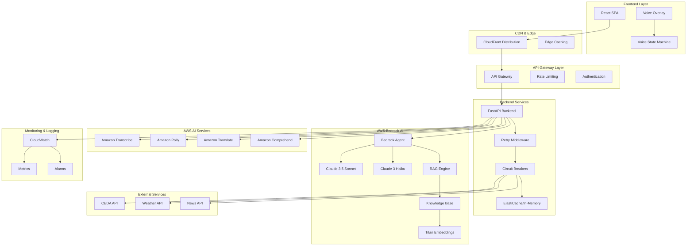

# Design Document: Krishi Production-Ready System

## Overview

This design document outlines the comprehensive technical approach for transforming the Krishi prototype into a production-ready MVP system. The design integrates:

1. **AWS Bedrock AI**: Foundation models (Claude 3.5 Sonnet, Claude 3 Haiku), RAG workflows, and Bedrock Agents
2. **Reliability Infrastructure**: Retry logic, circuit breakers, caching, and graceful degradation
3. **Voice Interaction**: Enhanced voice services with barge-in, echo cancellation, and multi-language support
4. **AWS Deployment**: CloudFront distribution, scalable backend, monitoring, and cost optimization
5. **Farmer Onboarding**: AI agent-based conversational onboarding flow

## Architecture

### High-Level Architecture



### Component Architecture

#### 1. Foundation Model Router

**Purpose**: Intelligently route queries to appropriate Foundation Models based on complexity.

**Interface**:
```python
class FoundationModelRouter:
    def __init__(self):
        self.claude_35_sonnet = "anthropic.claude-3-5-sonnet-20241022-v2:0"
        self.claude_3_haiku = "anthropic.claude-3-haiku-20240307-v1:0"
        self.complexity_analyzer = QueryComplexityAnalyzer()
    
    async def route_query(self, query: str, context: Optional[str] = None) -> str:
        """Route query to appropriate model based on complexity."""
        complexity = self.complexity_analyzer.analyze(query)
        
        if complexity == "simple":
            return await self.invoke_haiku(query, context)
        else:
            return await self.invoke_sonnet(query, context)
    
    async def invoke_sonnet(self, query: str, context: Optional[str]) -> str:
        """Invoke Claude 3.5 Sonnet for complex reasoning."""
        pass
    
    async def invoke_haiku(self, query: str, context: Optional[str]) -> str:
        """Invoke Claude 3 Haiku for simple queries."""
        pass
```

**Complexity Classification**:
- **Simple**: Greetings, single-fact lookups, yes/no questions, price queries
- **Complex**: Multi-step reasoning, decision support, scenario analysis, agricultural advice

#### 2. RAG Engine

**Purpose**: Retrieve relevant agricultural knowledge and generate grounded responses.

**Interface**:
```python
class RAGEngine:
    def __init__(self, knowledge_base_id: str, model_arn: str):
        self.kb_id = knowledge_base_id
        self.model_arn = model_arn
        self.bedrock_agent_runtime = boto3.client('bedrock-agent-runtime')
    
    async def retrieve_and_generate(
        self,
        query: str,
        language: str = "en",
        filters: Optional[Dict] = None
    ) -> Dict[str, Any]:
        """Retrieve relevant documents and generate response."""
        # 1. Semantic search over knowledge base
        retrieved_docs = await self.retrieve(query, language, filters)
        
        # 2. Combine context with query
        context = self._format_context(retrieved_docs)
        
        # 3. Generate response with Foundation Model
        response = await self.generate(query, context, language)
        
        return {
            "response": response,
            "sources": retrieved_docs,
            "confidence": self._calculate_confidence(retrieved_docs)
        }
    
    async def retrieve(
        self,
        query: str,
        language: str,
        filters: Optional[Dict]
    ) -> List[Dict]:
        """Retrieve top-k relevant documents."""
        response = self.bedrock_agent_runtime.retrieve(
            knowledgeBaseId=self.kb_id,
            retrievalQuery={'text': query},
            retrievalConfiguration={
                'vectorSearchConfiguration': {
                    'numberOfResults': 5,
                    'filter': filters or {}
                }
            }
        )
        return response['retrievalResults']
```

**Knowledge Base Structure**:
- **Documents**: Crop advisories, farming best practices, government schemes
- **Languages**: English, Telugu, Hindi
- **Metadata**: crop_type, language, category, region, season
- **Chunking**: 300-500 tokens with 10% overlap
- **Embeddings**: Amazon Titan Embeddings G1 - Text

#### 3. Bedrock Agent

**Purpose**: Orchestrate multi-tool conversations with maintained context.

**Action Groups**:
1. **Weather Action Group**: Get weather forecast for location
2. **Market Price Action Group**: Get current market prices for crop
3. **News Action Group**: Get relevant agricultural news
4. **Decision Support Action Group**: Generate harvest decision scenarios

**Interface**:
```python
class BedrockAgentService:
    def __init__(self, agent_id: str, agent_alias_id: str):
        self.agent_id = agent_id
        self.agent_alias_id = agent_alias_id
        self.bedrock_agent_runtime = boto3.client('bedrock-agent-runtime')
    
    async def invoke_agent(
        self,
        session_id: str,
        input_text: str,
        enable_trace: bool = False
    ) -> Dict[str, Any]:
        """Invoke Bedrock Agent with session management."""
        response = self.bedrock_agent_runtime.invoke_agent(
            agentId=self.agent_id,
            agentAliasId=self.agent_alias_id,
            sessionId=session_id,
            inputText=input_text,
            enableTrace=enable_trace
        )
        
        # Stream response
        completion = ""
        for event in response['completion']:
            if 'chunk' in event:
                chunk = event['chunk']
                completion += chunk['bytes'].decode('utf-8')
        
        return {
            "response": completion,
            "session_id": session_id,
            "trace": response.get('trace', []) if enable_trace else None
        }
```

#### 4. Enhanced Voice Services

**Transcription Service**:
```python
class TranscriptionService:
    def __init__(self):
        self.transcribe = boto3.client('transcribe')
        self.s3 = boto3.client('s3')
        self.bucket_name = os.getenv("TRANSCRIBE_BUCKET")
    
    async def transcribe_audio(
        self,
        audio_bytes: bytes,
        language_code: str = "en-IN"
    ) -> str:
        """Transcribe audio using Amazon Transcribe."""
        # Upload to S3
        file_key = f"audio/{uuid.uuid4()}.wav"
        self.s3.put_object(
            Bucket=self.bucket_name,
            Key=file_key,
            Body=audio_bytes
        )
        
        # Start transcription job
        job_name = f"transcribe-{uuid.uuid4()}"
        self.transcribe.start_transcription_job(
            TranscriptionJobName=job_name,
            Media={'MediaFileUri': f"s3://{self.bucket_name}/{file_key}"},
            MediaFormat='wav',
            LanguageCode=language_code
        )
        
        # Poll for completion
        while True:
            status = self.transcribe.get_transcription_job(
                TranscriptionJobName=job_name
            )
            job_status = status['TranscriptionJob']['TranscriptionJobStatus']
            
            if job_status in ['COMPLETED', 'FAILED']:
                break
            
            await asyncio.sleep(1)
        
        if job_status == 'COMPLETED':
            transcript_uri = status['TranscriptionJob']['Transcript']['TranscriptFileUri']
            response = requests.get(transcript_uri)
            data = response.json()
            return data['results']['transcripts'][0]['transcript']
        
        raise Exception(f"Transcription failed: {job_status}")
```

**TTS Service**:
```python
class TTSService:
    def __init__(self):
        self.polly = boto3.client('polly')
        self.voice_mapping = {
            "en-IN": "Aria",  # Neural voice
            "te-IN": "Kajal",  # Neural voice
            "hi-IN": "Aditi"   # Neural voice
        }
    
    async def synthesize_speech(
        self,
        text: str,
        language_code: str = "en-IN"
    ) -> bytes:
        """Synthesize speech using Amazon Polly neural voices."""
        voice_id = self.voice_mapping.get(language_code, "Aria")
        
        response = self.polly.synthesize_speech(
            Text=text,
            OutputFormat='mp3',
            VoiceId=voice_id,
            Engine='neural'
        )
        
        return response['AudioStream'].read()
```

#### 5. Onboarding Service

**Purpose**: AI agent-based conversational onboarding to collect farmer profile.

**Interface**:
```python
class OnboardingService:
    def __init__(
        self,
        ai_service,
        weather_service,
        price_service,
        news_service,
        decision_service
    ):
        self.ai_service = ai_service
        self.weather_service = weather_service
        self.price_service = price_service
        self.news_service = news_service
        self.decision_service = decision_service
    
    async def process_input(
        self,
        user_input: str,
        session_state: Dict[str, Any],
        language: str = 'en'
    ) -> Dict[str, Any]:
        """Process user input using AI agent."""
        # Build conversation context with system prompt
        system_prompt = self._get_system_prompt(language)
        conversation_history = session_state.get('conversation_history', [])
        
        # Add system prompt if first message
        if not conversation_history:
            conversation_history.append({
                'role': 'system',
                'content': system_prompt
            })
        
        # Add user input
        conversation_history.append({
            'role': 'user',
            'content': user_input
        })
        
        # Call AI agent
        agent_response = await self.ai_service.generate_response(
            prompt=user_input,
            context=conversation_history,
            language=language
        )
        
        # Check if profile is complete (JSON response)
        if '{' in agent_response and '"complete"' in agent_response:
            parsed = json.loads(self._extract_json(agent_response))
            
            if parsed.get('complete'):
                profile = parsed.get('profile')
                
                # Generate decision scenario
                scenario = await self._generate_decision_scenario(
                    profile,
                    language
                )
                
                return {
                    'profile': profile,
                    'completed': True,
                    'scenario': scenario,
                    'next_prompt': scenario.get('recommendation')
                }
        
        # Continue conversation
        return {
            'completed': False,
            'next_prompt': agent_response,
            'conversation_history': conversation_history
        }
```

#### 6. Retry Middleware

**Purpose**: Automatic retry with exponential backoff for external API calls.

**Interface**:
```python
from tenacity import (
    retry,
    stop_after_attempt,
    wait_exponential,
    retry_if_exception_type
)

@retry(
    stop=stop_after_attempt(3),
    wait=wait_exponential(multiplier=1, min=1, max=10),
    retry=retry_if_exception_type((
        requests.exceptions.ConnectionError,
        requests.exceptions.Timeout,
        requests.exceptions.HTTPError
    ))
)
async def fetch_with_retry(url: str, **kwargs) -> dict:
    """Fetch data with automatic retry."""
    async with httpx.AsyncClient() as client:
        response = await client.get(url, **kwargs)
        response.raise_for_status()
        return response.json()
```

#### 7. Circuit Breaker

**Purpose**: Prevent cascading failures when services are down.

**Interface**:
```python
class CircuitBreaker:
    def __init__(
        self,
        failure_threshold: int = 5,
        timeout: int = 60,
        expected_exception: Type[Exception] = Exception
    ):
        self.failure_threshold = failure_threshold
        self.timeout = timeout
        self.expected_exception = expected_exception
        self.failure_count = 0
        self.last_failure_time = None
        self.state = "CLOSED"  # CLOSED, OPEN, HALF_OPEN
    
    async def call(self, func, *args, **kwargs):
        """Execute function with circuit breaker protection."""
        if self.state == "OPEN":
            if time.time() - self.last_failure_time > self.timeout:
                self.state = "HALF_OPEN"
            else:
                raise CircuitBreakerOpenError(
                    f"Circuit breaker is OPEN for {func.__name__}"
                )
        
        try:
            result = await func(*args, **kwargs)
            
            if self.state == "HALF_OPEN":
                self.state = "CLOSED"
                self.failure_count = 0
            
            return result
            
        except self.expected_exception as e:
            self.failure_count += 1
            self.last_failure_time = time.time()
            
            if self.failure_count >= self.failure_threshold:
                self.state = "OPEN"
                logger.error(
                    f"Circuit breaker opened for {func.__name__} "
                    f"after {self.failure_count} failures"
                )
            
            raise
```

**Circuit Breaker Instances**:
- `ceda_circuit_breaker`: For CEDA API calls
- `weather_circuit_breaker`: For Weather API calls
- `news_circuit_breaker`: For News API calls
- `bedrock_circuit_breaker`: For Bedrock API calls

#### 8. Cache Service

**Purpose**: Store frequently accessed data to reduce API calls and enable offline functionality.

**Interface**:
```python
class CacheService:
    def __init__(self, redis_url: Optional[str] = None):
        if redis_url:
            self.redis = redis.from_url(redis_url)
            self.backend = "redis"
        else:
            self.cache = {}
            self.backend = "memory"
        
        self.ttl = {
            "price": 6 * 3600,      # 6 hours
            "weather": 3 * 3600,    # 3 hours
            "news": 1 * 3600,       # 1 hour
            "mappings": 24 * 3600   # 24 hours
        }
    
    async def get(self, key: str) -> Optional[dict]:
        """Get cached value if not expired."""
        if self.backend == "redis":
            value = self.redis.get(key)
            if value:
                return json.loads(value)
        else:
            if key in self.cache:
                data, timestamp = self.cache[key]
                category = key.split(':')[0]
                ttl = self.ttl.get(category, 3600)
                
                if time.time() - timestamp < ttl:
                    return data
                else:
                    del self.cache[key]
        
        return None
    
    async def set(self, key: str, value: dict):
        """Set cached value with TTL."""
        category = key.split(':')[0]
        ttl = self.ttl.get(category, 3600)
        
        if self.backend == "redis":
            self.redis.setex(
                key,
                ttl,
                json.dumps(value)
            )
        else:
            self.cache[key] = (value, time.time())
```

**Cache Keys**:
- `price:{crop}:{location}:{date}` - Market prices
- `weather:{lat}:{lon}:{date}` - Weather forecasts
- `news:{crop}:{region}:{language}` - News articles
- `mappings:ceda` - CEDA commodity/geography mappings
- `decision:{hash}` - Decision scenarios

#### 9. Voice State Machine

**Purpose**: Formalize voice interaction states to prevent race conditions.

**States**:
- `IDLE`: No interaction, waiting for user to start
- `LISTENING`: Actively listening for user speech
- `PROCESSING`: Transcribing and analyzing user input
- `THINKING`: AI generating response
- `SPEAKING`: Playing AI response audio
- `PAUSED`: User manually paused interaction
- `ERROR`: Error state, waiting for recovery

**State Transitions**:
```typescript
type VoiceState = 'IDLE' | 'LISTENING' | 'PROCESSING' | 'THINKING' | 'SPEAKING' | 'PAUSED' | 'ERROR';

interface VoiceStateMachine {
  state: VoiceState;
  canTransition(to: VoiceState): boolean;
  transition(to: VoiceState): void;
  onStateChange(callback: (state: VoiceState) => void): void;
}

const transitions: Record<VoiceState, VoiceState[]> = {
  IDLE: ['LISTENING'],
  LISTENING: ['PROCESSING', 'PAUSED', 'ERROR'],
  PROCESSING: ['THINKING', 'PAUSED', 'ERROR'],
  THINKING: ['SPEAKING', 'PAUSED', 'ERROR'],
  SPEAKING: ['LISTENING', 'PROCESSING', 'PAUSED', 'ERROR'],
  PAUSED: ['LISTENING', 'IDLE'],
  ERROR: ['IDLE']
};
```

## Data Models

### Foundation Model Request/Response

```python
class FoundationModelRequest(BaseModel):
    prompt: str
    model_id: str
    max_tokens: int = 2048
    temperature: float = 0.7
    top_p: float = 0.9
    stop_sequences: List[str] = []
    system_prompt: Optional[str] = None

class FoundationModelResponse(BaseModel):
    response: str
    model_id: str
    input_tokens: int
    output_tokens: int
    stop_reason: str
    latency_ms: float
```

### RAG Request/Response

```python
class RAGRequest(BaseModel):
    query: str
    language: str = "en"
    filters: Optional[Dict[str, Any]] = None
    max_results: int = 5

class RAGResponse(BaseModel):
    response: str
    sources: List[RetrievedDocument]
    confidence: float
    model_used: str
    
class RetrievedDocument(BaseModel):
    content: str
    score: float
    metadata: Dict[str, Any]
    source_uri: Optional[str]
```

### Bedrock Agent Request/Response

```python
class AgentRequest(BaseModel):
    session_id: str
    input_text: str
    enable_trace: bool = False

class AgentResponse(BaseModel):
    response: str
    session_id: str
    actions_invoked: List[str]
    trace: Optional[List[Dict]] = None
```

### Onboarding State

```python
class OnboardingState(BaseModel):
    profile: FarmerProfile
    conversation_history: List[Message]
    completed: bool = False

class FarmerProfile(BaseModel):
    name: Optional[str] = None
    location: Optional[str] = None
    primary_crop: Optional[str] = None
    farm_size_acres: Optional[float] = None
    created_at: datetime

class Message(BaseModel):
    role: Literal["system", "user", "assistant"]
    content: str
    timestamp: datetime
```

## AWS Infrastructure

### Compute Layer

**Option 1: AWS Lambda (Recommended for MVP)**
- Serverless, pay-per-use
- Auto-scaling
- 15-minute timeout limit
- Good for: API endpoints, event-driven processing

**Option 2: ECS Fargate**
- Containerized deployment
- More control over environment
- Good for: Long-running processes, WebSocket connections

### Storage Layer

- **S3**: Static assets (frontend), audio files, knowledge base documents
- **ElastiCache Redis**: Distributed caching (production)
- **In-Memory Cache**: Development/staging

### AI/ML Layer

- **Amazon Bedrock**: Foundation models, RAG, Agents
- **Amazon Transcribe**: Speech-to-text
- **Amazon Polly**: Text-to-speech
- **Amazon Translate**: Cross-language translation
- **Amazon Comprehend**: NLU and sentiment analysis

### Monitoring Layer

- **CloudWatch Logs**: Application logs
- **CloudWatch Metrics**: Performance metrics
- **CloudWatch Alarms**: Alerting
- **X-Ray**: Distributed tracing (optional)

### Security Layer

- **Secrets Manager**: API keys, credentials
- **IAM Roles**: Service permissions
- **API Gateway**: Authentication, rate limiting
- **CloudFront**: DDoS protection, SSL/TLS

## Cost Optimization Strategy

### 1. Model Selection

- **Simple queries** → Claude 3 Haiku ($0.25/MTok input, $1.25/MTok output)
- **Complex queries** → Claude 3.5 Sonnet ($3/MTok input, $15/MTok output)
- **Savings**: 10-12x cost reduction for simple queries

### 2. Prompt Caching

- Cache system prompts and knowledge base context
- **Savings**: 90% reduction on cached tokens ($0.30/MTok vs $3/MTok)

### 3. Compute Optimization

- Use Lambda for variable workloads (pay-per-use)
- Auto-scale down during low traffic
- Use spot instances for non-critical workloads

### 4. Storage Optimization

- S3 Intelligent-Tiering for infrequently accessed data
- CloudWatch log retention: 30 days (dev), 90 days (prod)
- In-memory cache for dev/staging (no ElastiCache cost)

### 5. Caching Strategy

- Cache market prices (6h TTL) - reduce CEDA API calls
- Cache weather forecasts (3h TTL) - reduce Weather API calls
- Cache news articles (1h TTL) - reduce News API calls
- Cache RAG responses for common queries

## Deployment Architecture

### Development Environment

```yaml
Frontend:
  - Local development server (Vite)
  - Hot reload enabled

Backend:
  - Local FastAPI server
  - In-memory cache
  - Local AI service (Ollama) or AWS Bedrock
  - Mock external APIs

Infrastructure:
  - No CloudFront
  - No ElastiCache
  - CloudWatch logging only
```

### Production Environment

```yaml
Frontend:
  - S3 bucket (private)
  - CloudFront distribution
  - SSL certificate
  - Edge caching

Backend:
  - Lambda functions or ECS Fargate
  - API Gateway
  - ElastiCache Redis cluster
  - AWS Bedrock services

Infrastructure:
  - CloudWatch monitoring
  - Secrets Manager
  - Auto-scaling policies
  - Cost alarms
```

## Error Handling Strategy

### Error Classification

1. **Recoverable Errors**: Retry with exponential backoff
   - Network timeouts
   - Rate limiting (429)
   - Temporary service unavailability (503)

2. **Degraded Functionality**: Use fallback data
   - External API failures → cached data
   - Bedrock failures → simpler model or cached response
   - Knowledge Base unavailable → direct LLM response

3. **Fatal Errors**: Fail fast with clear message
   - Missing required configuration
   - Invalid credentials
   - Malformed requests

### Fallback Hierarchy

```
Primary: AWS Bedrock (Claude 3.5 Sonnet)
  ↓ (on failure)
Fallback 1: AWS Bedrock (Claude 3 Haiku)
  ↓ (on failure)
Fallback 2: Cached response (if available)
  ↓ (on failure)
Fallback 3: Default response with error message
```

## Security Considerations

1. **API Keys**: Store in Secrets Manager, rotate regularly
2. **Authentication**: API Gateway with API keys or JWT
3. **Rate Limiting**: API Gateway throttling (1000 req/sec)
4. **Input Validation**: Pydantic models for all inputs
5. **Output Sanitization**: Prevent prompt injection attacks
6. **HTTPS Only**: Enforce SSL/TLS via CloudFront
7. **CORS**: Restrict to known origins
8. **Logging**: Never log PII or credentials

## Performance Targets

- **API Response Time**: p95 < 2 seconds
- **Voice Transcription**: < 3 seconds
- **TTS Generation**: < 2 seconds
- **RAG Query**: < 4 seconds
- **Agent Invocation**: < 5 seconds
- **Cache Hit Rate**: > 60%
- **Uptime**: 99.5% (MVP), 99.9% (production)

## Monitoring & Alerting

### Key Metrics

1. **Request Metrics**: Count, latency, error rate
2. **AI Metrics**: Token usage, model selection, cost
3. **Cache Metrics**: Hit rate, eviction rate
4. **Circuit Breaker Metrics**: State, failure count
5. **Voice Metrics**: Transcription accuracy, TTS latency

### Alarms

1. **High Error Rate**: > 5% errors in 5 minutes
2. **High Latency**: p95 > 5 seconds
3. **Circuit Breaker Open**: Any circuit breaker opens
4. **High Cost**: Daily cost > $50
5. **Low Cache Hit Rate**: < 40% hit rate

## Testing Strategy

### Unit Tests
- Individual components (services, utilities)
- Mock external dependencies
- Target: 70% code coverage

### Integration Tests
- API endpoints with real services
- Database interactions
- External API integrations

### Property-Based Tests
- Invariants across randomized inputs
- Data validation properties
- State machine properties

### End-to-End Tests
- Complete user flows
- Voice interaction scenarios
- Multi-language support
- Error recovery

## Migration Path

### Phase 1: Foundation (Weeks 1-2)
- Set up AWS infrastructure
- Deploy basic Bedrock integration
- Implement retry and circuit breaker

### Phase 2: AI Enhancement (Weeks 3-4)
- Implement RAG engine
- Create Bedrock Agent
- Enhance voice services

### Phase 3: Reliability (Weeks 5-6)
- Add comprehensive error handling
- Implement caching
- Add monitoring and alerting

### Phase 4: Optimization (Weeks 7-8)
- Optimize costs
- Performance tuning
- Load testing

### Phase 5: Production (Week 9+)
- Final testing
- Documentation
- Production deployment
- User onboarding
