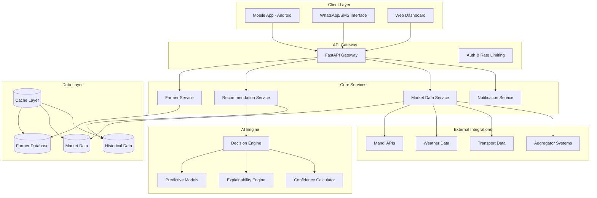
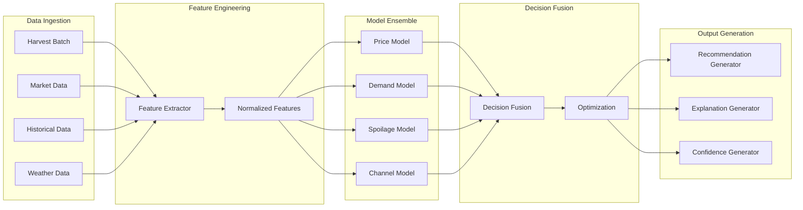
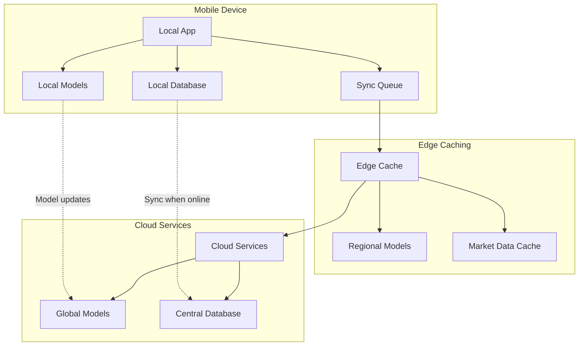

# Design Document: Smart Farmer–Market Relay

## Overview

Smart Farmer–Market Relay is an AI-powered selling copilot designed to help farmers make optimal post-harvest selling decisions. The system combines predictive modeling, market intelligence, and explainable AI to provide actionable recommendations on when, where, and at what price to sell agricultural produce.

The architecture follows a mobile-first, offline-capable design that can operate in low-connectivity rural environments while scaling from single districts to multi-regional deployments.

## Architecture

### High-Level System Architecture



### Component Breakdown

**Client Layer:**
- **Mobile App (Android)**: Primary interface for farmers with offline-first capabilities
- **WhatsApp/SMS Interface**: Low-bandwidth communication channel for recommendations
- **Web Dashboard**: Administrative interface for FPOs and system monitoring

**API Gateway:**
- **FastAPI Gateway**: RESTful API endpoints with automatic documentation
- **Auth & Rate Limiting**: JWT-based authentication and request throttling

**Core Services:**
- **Farmer Service**: Manages farmer profiles, preferences, and harvest data
- **Recommendation Service**: Orchestrates AI decision-making process
- **Market Data Service**: Aggregates and processes market intelligence
- **Notification Service**: Handles SMS, WhatsApp, and push notifications

**AI Engine:**
- **Decision Engine**: Core AI orchestrator that combines multiple models
- **Predictive Models**: Time series forecasting and demand prediction
- **Explainability Engine**: Generates human-readable explanations
- **Confidence Calculator**: Estimates recommendation reliability

## Components and Interfaces

### Farmer Service Interface

```python
class FarmerService:
    def create_farmer_profile(self, farmer_data: FarmerProfile) -> str
    def update_preferences(self, farmer_id: str, preferences: FarmerPreferences) -> bool
    def submit_harvest_batch(self, farmer_id: str, harvest: HarvestBatch) -> str
    def get_farmer_history(self, farmer_id: str) -> List[HistoricalTransaction]
```

### Recommendation Service Interface

```python
class RecommendationService:
    def generate_recommendation(self, harvest_batch_id: str) -> Recommendation
    def get_recommendation_explanation(self, recommendation_id: str) -> Explanation
    def update_recommendation(self, recommendation_id: str, market_changes: MarketUpdate) -> Recommendation
    def track_recommendation_outcome(self, recommendation_id: str, actual_outcome: SaleOutcome) -> None
```

### Decision Engine Interface

```python
class DecisionEngine:
    def analyze_harvest_batch(self, harvest: HarvestBatch, market_data: MarketData) -> AnalysisResult
    def predict_optimal_timing(self, crop_data: CropData, spoilage_model: SpoilageModel) -> TimingPrediction
    def rank_selling_channels(self, options: List[SellingChannel], farmer_preferences: FarmerPreferences) -> RankedChannels
    def calculate_confidence(self, prediction: Prediction, data_quality: DataQuality) -> ConfidenceScore
```

### Market Data Service Interface

```python
class MarketDataService:
    def fetch_current_prices(self, crop_type: str, region: str) -> PriceData
    def get_demand_forecast(self, crop_type: str, time_horizon: int) -> DemandForecast
    def analyze_supply_trends(self, region: str, crop_type: str) -> SupplyAnalysis
    def integrate_external_data(self, data_source: str, raw_data: Dict) -> ProcessedData
```

## Data Models

### Core Data Structures

```python
@dataclass
class FarmerProfile:
    farmer_id: str
    name: str
    location: Location
    contact_info: ContactInfo
    preferred_language: str
    farm_size: float
    primary_crops: List[str]
    created_at: datetime

@dataclass
class HarvestBatch:
    batch_id: str
    farmer_id: str
    crop_type: str
    quantity: float
    quality_grade: str
    harvest_date: date
    storage_conditions: StorageInfo
    preferred_channels: List[str]
    minimum_price: Optional[float]

@dataclass
class Recommendation:
    recommendation_id: str
    batch_id: str
    selling_window: DateRange
    recommended_channel: SellingChannel
    price_range: PriceRange
    confidence_score: float
    explanation: str
    urgency_level: UrgencyLevel
    generated_at: datetime

@dataclass
class MarketData:
    region: str
    crop_type: str
    current_price: float
    price_trend: PriceTrend
    demand_level: DemandLevel
    supply_level: SupplyLevel
    weather_impact: WeatherImpact
    transport_costs: TransportCosts
    timestamp: datetime

@dataclass
class SellingChannel:
    channel_id: str
    channel_type: ChannelType  # MANDI, AGGREGATOR, DIRECT_BUYER
    name: str
    location: Location
    commission_rate: float
    payment_terms: PaymentTerms
    capacity: int
    reliability_score: float
```

### AI Model Data Structures

```python
@dataclass
class PredictionInput:
    harvest_data: HarvestBatch
    market_conditions: MarketData
    historical_patterns: HistoricalData
    weather_forecast: WeatherData
    transport_availability: TransportData

@dataclass
class ModelOutput:
    price_prediction: PricePrediction
    demand_forecast: DemandForecast
    spoilage_timeline: SpoilageTimeline
    channel_rankings: List[ChannelRanking]
    confidence_metrics: ConfidenceMetrics

@dataclass
class ExplanationComponents:
    primary_factors: List[str]
    market_reasoning: str
    timing_rationale: str
    channel_justification: str
    risk_assessment: str
    confidence_explanation: str
```

## AI Architecture

### AI Pipeline Overview



### Model Specifications

**Price Prediction Model:**
- **Type**: Time Series Forecasting (LSTM + ARIMA ensemble)
- **Inputs**: Historical prices, seasonal patterns, supply/demand indicators
- **Output**: Price range prediction with confidence intervals
- **Update Frequency**: Daily
- **Accuracy Target**: ±15% for 7-day forecasts

**Demand Forecasting Model:**
- **Type**: Probabilistic forecasting with external regressors
- **Inputs**: Historical demand, weather patterns, festival calendar, economic indicators
- **Output**: Demand probability distribution
- **Update Frequency**: Weekly
- **Accuracy Target**: 80% accuracy for demand level classification

**Spoilage Risk Model:**
- **Type**: Survival analysis with Cox proportional hazards
- **Inputs**: Crop type, storage conditions, weather, transportation time
- **Output**: Spoilage probability over time
- **Update Frequency**: Real-time
- **Accuracy Target**: 85% accuracy for 14-day spoilage prediction

**Channel Optimization Model:**
- **Type**: Multi-criteria decision analysis with reinforcement learning
- **Inputs**: Channel characteristics, farmer preferences, market conditions
- **Output**: Ranked channel recommendations with expected outcomes
- **Update Frequency**: Real-time
- **Accuracy Target**: 70% farmer satisfaction with top recommendation

### Explainability Strategy

**LIME-based Local Explanations:**
- Generate feature importance for individual recommendations
- Highlight top 3 factors influencing each decision
- Provide counterfactual scenarios ("If you wait 2 more days...")

**SHAP Values for Global Understanding:**
- Understand model behavior across different scenarios
- Identify systematic biases or regional variations
- Generate model performance reports

**Natural Language Generation:**
- Convert technical explanations to farmer-friendly language
- Use agricultural terminology and local context
- Provide actionable insights rather than just predictions

### Confidence Estimation

**Multi-layered Confidence Calculation:**

1. **Data Quality Score (0-1)**:
   - Freshness of market data
   - Completeness of input features
   - Historical data availability

2. **Model Uncertainty (0-1)**:
   - Prediction variance across ensemble models
   - Distance from training data distribution
   - Cross-validation performance metrics

3. **External Validation (0-1)**:
   - Agreement with expert rules
   - Consistency with recent market trends
   - Validation against similar historical cases

**Final Confidence Score**: Weighted average of all components, scaled to 0-100 for user display.

## Offline and Low-Bandwidth Architecture

### Offline-First Design



**Local Capabilities:**
- Basic recommendation generation using cached models
- Offline data entry and storage
- Essential market data caching (7-day rolling window)
- SMS/WhatsApp integration for critical updates

**Sync Strategy:**
- Opportunistic sync when connectivity available
- Priority-based data synchronization
- Conflict resolution for offline modifications
- Bandwidth-optimized data transfer

### Low-Bandwidth Optimizations

**Data Compression:**
- JSON payload compression (gzip)
- Image optimization for UI elements
- Differential sync for market data updates
- Binary protocol for model updates

**Progressive Loading:**
- Essential data first, detailed information on demand
- Lazy loading of historical data
- Cached UI components
- Optimized API response sizes

**SMS/WhatsApp Integration:**
- Structured message templates
- Key recommendation summaries
- Alert-based notifications
- Two-way communication for feedback

## Error Handling

### Error Categories and Responses

**Data Quality Errors:**
- Missing or invalid input data
- Outdated market information
- Inconsistent historical data
- **Response**: Graceful degradation with reduced confidence scores

**Model Prediction Errors:**
- Model convergence failures
- Extreme outlier predictions
- Conflicting model outputs
- **Response**: Fallback to rule-based recommendations with clear disclaimers

**System Integration Errors:**
- External API failures
- Database connectivity issues
- Network timeouts
- **Response**: Use cached data and offline capabilities

**User Input Errors:**
- Invalid harvest data
- Conflicting preferences
- Incomplete information
- **Response**: Clear validation messages and guided correction

### Fallback Mechanisms

**Hierarchical Fallback Strategy:**
1. **Primary**: Full AI recommendation with high confidence
2. **Secondary**: AI recommendation with reduced confidence and caveats
3. **Tertiary**: Rule-based recommendation with historical averages
4. **Emergency**: Basic guidance based on crop type and season

**Graceful Degradation:**
- Always provide some level of guidance
- Clear communication about system limitations
- Maintain user trust through transparency
- Collect feedback for system improvement

## Testing Strategy

### Dual Testing Approach

The testing strategy combines comprehensive unit testing for specific scenarios with property-based testing to validate universal system behaviors across diverse inputs.

**Unit Testing Focus:**
- Specific farmer scenarios and edge cases
- Integration points between services
- Error handling and fallback mechanisms
- API endpoint validation
- Model prediction accuracy on known datasets

**Property-Based Testing Focus:**
- Universal properties that must hold across all valid inputs
- System behavior under various market conditions
- Data consistency and integrity
- Performance characteristics under load
- AI model fairness and bias detection

**Testing Configuration:**
- Property-based tests: Minimum 100 iterations per test
- Unit tests: Comprehensive coverage of critical paths
- Integration tests: End-to-end user journey validation
- Performance tests: Load testing for scalability requirements
- AI model tests: Accuracy, fairness, and explainability validation

**Test Environment:**
- Staging environment with realistic data volumes
- Synthetic data generation for privacy-compliant testing
- A/B testing framework for recommendation quality
- Continuous monitoring of model performance in production

The testing approach ensures both correctness of individual components and system-wide reliability across the diverse conditions expected in agricultural markets.

## Correctness Properties

*A property is a characteristic or behavior that should hold true across all valid executions of a system—essentially, a formal statement about what the system should do. Properties serve as the bridge between human-readable specifications and machine-verifiable correctness guarantees.*

### Property 1: Input Validation Completeness
*For any* farmer input submission, if the data is incomplete or invalid (negative quantities, future dates, missing required fields), the system should reject the submission and provide specific error messages indicating what needs to be corrected.
**Validates: Requirements 1.2, 1.3**

### Property 2: Valid Input Processing
*For any* complete and valid harvest batch submission, the system should successfully store the information and automatically trigger the recommendation generation process.
**Validates: Requirements 1.4**

### Property 3: Recommendation Structure Completeness
*For any* generated recommendation, the output should include all required components: selling window (in days), recommended channel with rationale, price range with min/max values, confidence score (0-100), and plain-language explanation.
**Validates: Requirements 3.1, 3.2, 3.3, 3.4**

### Property 4: Single Primary Recommendation
*For any* harvest batch, the system should generate exactly one primary recommendation to avoid decision paralysis.
**Validates: Requirements 3.5**

### Property 5: Decision Engine Factor Analysis
*For any* harvest batch input, the decision engine should analyze all required factors: market trends, demand signals, perishability factors, and supply reliability before generating recommendations.
**Validates: Requirements 2.1**

### Property 6: Confidence Score Bounds
*For any* recommendation generated by the decision engine, the confidence score should be within the valid range of 0-100.
**Validates: Requirements 2.4**

### Property 7: Processing Time Limits
*For any* recommendation request, the decision engine should complete processing within 30 seconds to maintain real-time user experience.
**Validates: Requirements 2.5**

### Property 8: Aggregation Opportunity Detection
*For any* set of farmers with similar crops in the same region, the system should identify and suggest aggregated selling opportunities when beneficial.
**Validates: Requirements 4.1**

### Property 9: Geographic Optimization
*For any* farmer-to-aggregator connection, the system should consider geographic proximity and transportation costs in the matching algorithm.
**Validates: Requirements 4.2**

### Property 10: Real-time Availability Tracking
*For any* established relay connection, changes in availability should be tracked and updated in real-time across the system.
**Validates: Requirements 4.4**

### Property 11: Supply Chain Transparency
*For any* farmer connected through the relay system, the complete supply chain path from farmer to end buyer should be visible and accessible.
**Validates: Requirements 4.5**

### Property 12: Offline Functionality Preservation
*For any* farmer operating in offline mode, the system should allow data input, cache essential market data, and sync all changes when connectivity is restored without data loss.
**Validates: Requirements 5.1, 5.3, 5.4**

### Property 13: Low-Bandwidth Communication
*For any* farmer in a low-bandwidth environment, the system should provide SMS and WhatsApp summaries of key recommendations and compress all data transfers.
**Validates: Requirements 5.2, 5.5**

### Property 14: User Interaction Feedback
*For any* farmer interaction with the interface, the system should provide immediate visual feedback confirming the action was received and processed.
**Validates: Requirements 6.3**

### Property 15: Multi-Orientation Support
*For any* mobile device orientation (portrait or landscape), the system interface should remain fully functional and properly formatted.
**Validates: Requirements 6.5**

### Property 16: Explanation Completeness
*For any* recommendation provided, the system should include plain-language explanations of key influencing factors and detailed breakdowns available on request.
**Validates: Requirements 7.1, 7.4**

### Property 17: Confidence Explanation
*For any* confidence score displayed, the system should explain what factors contribute to higher or lower confidence levels.
**Validates: Requirements 7.2**

### Property 18: Market Change Notifications
*For any* significant market condition change affecting existing recommendations, the system should notify affected farmers and explain the impact on their recommendations.
**Validates: Requirements 7.3**

### Property 19: Data Source Integration
*For any* market data collection process, the system should integrate all required sources: local mandi prices, aggregator rates, and direct buyer demands.
**Validates: Requirements 8.1**

### Property 20: Regional Factor Consideration
*For any* regional market analysis, the system should account for transportation costs and regional price variations in its calculations.
**Validates: Requirements 8.2**

### Property 21: Data Freshness Impact
*For any* market data that becomes outdated, the system should flag the data freshness issue and adjust confidence scores accordingly.
**Validates: Requirements 8.3**

### Property 22: Data Quality Validation
*For any* market data before use in recommendations, the system should validate data quality and flag anomalies that could affect recommendation accuracy.
**Validates: Requirements 8.5**

### Property 23: Farmer Preference Management
*For any* farmer preference setting (channels, minimum prices), the system should store the preferences and immediately recalculate recommendations when preferences are updated.
**Validates: Requirements 9.1, 9.4**

### Property 24: Override and History Tracking
*For any* farmer disagreement with recommendations, the system should allow manual overrides while maintaining a complete history of both original recommendations and farmer decisions.
**Validates: Requirements 9.2**

### Property 25: Preference Conflict Explanation
*For any* situation where farmer preferences conflict with optimal recommendations, the system should clearly explain the trade-offs involved in following preferences versus optimal suggestions.
**Validates: Requirements 9.3**

### Property 26: Performance Under Load
*For any* increase in user load, the system should maintain response times under 5 seconds for recommendation generation and handle at least 1000 concurrent users without performance degradation.
**Validates: Requirements 10.1, 10.3**

### Property 27: Regional Scalability
*For any* new region added to the system, region-specific models and data sources should be supported without affecting existing regional functionality.
**Validates: Requirements 10.2**

### Property 28: System Health Monitoring
*For any* performance issue or system health problem, the monitoring system should detect and alert administrators to enable rapid response.
**Validates: Requirements 10.5**

### Property 29: Data Encryption Compliance
*For any* farmer data collected or stored, all personal and harvest information should be encrypted both in transit and at rest using industry-standard encryption methods.
**Validates: Requirements 11.1**

### Property 30: Access Control Enforcement
*For any* attempt to access farmer information, the system should enforce access controls ensuring only authorized personnel can view sensitive data.
**Validates: Requirements 11.2**

### Property 31: Data Deletion and Privacy
*For any* farmer request for data deletion, the system should remove all personal information while preserving anonymized analytics data for system improvement.
**Validates: Requirements 11.3**

### Property 32: Consent-Based Data Sharing
*For any* data sharing with external partners, the system should obtain explicit farmer consent and limit shared data to only necessary information for the specific purpose.
**Validates: Requirements 11.4**

### Property 33: Comprehensive Language Support
*For any* supported regional language (Hindi, Tamil, Telugu, Marathi, Gujarati), all interface elements, recommendations, and explanations should be available in that language, and farmers should be able to switch languages without losing session data.
**Validates: Requirements 12.1, 12.2, 12.5**